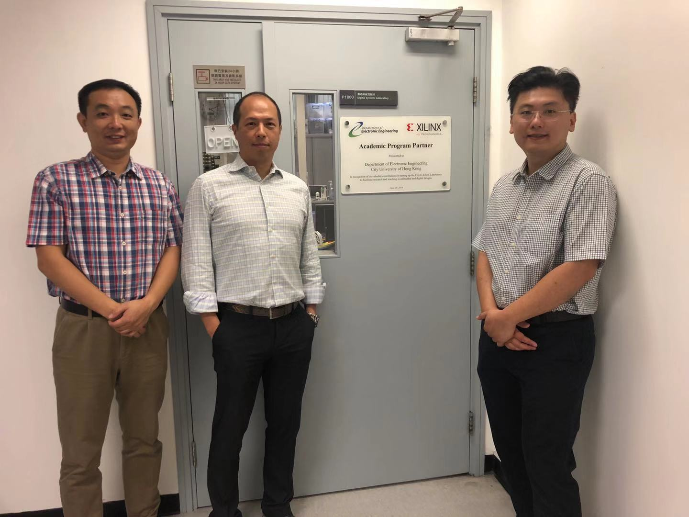
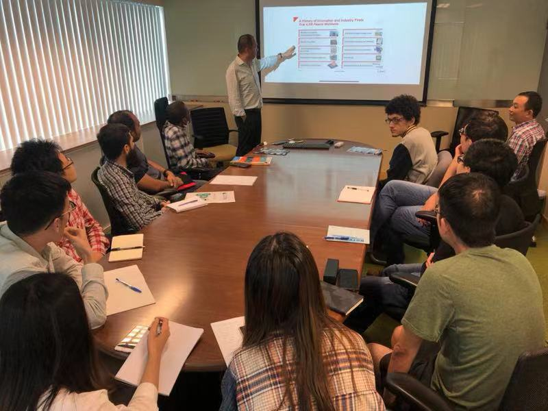

<!--more-->
|  |  |
|-----------------|-----------------|

Today we have two technical staff from Xilinx visiting the joint laboratory in EE department and giving CALAS members an informative talk about current development and diverse application of Xilinx FPGA. CALAS students also acquire an overview of the next generation FPGA and get more familiar with the chip they use. Thanks for the opportunity.