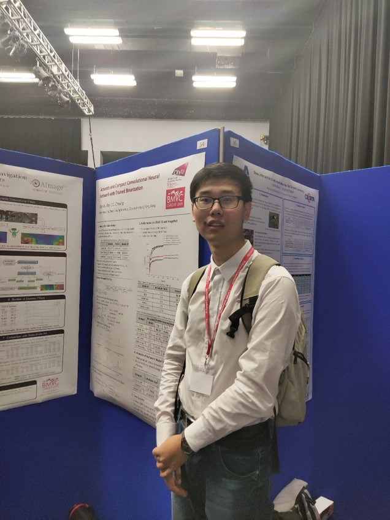
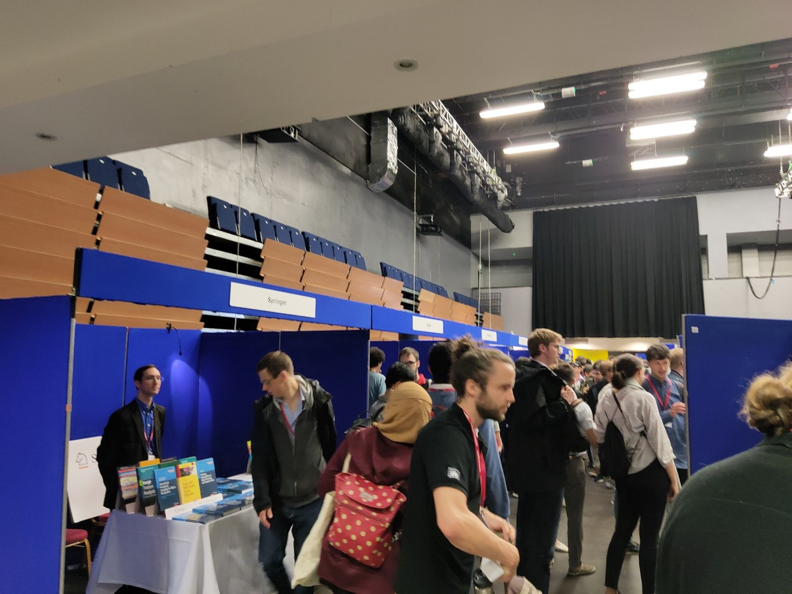

<!--more-->
|  |  |
|-----------------|-----------------|

Our work titled “Accurate and Compact Convolutional Neural Networks with Trained Binarization” was presented in 30th British Machine Vision Conference, one of the major conferences in computer vision, in oral and poster.

For more information:[Link](https://bmvc2019.org/wp-content/uploads/papers/0588-paper.pdf)