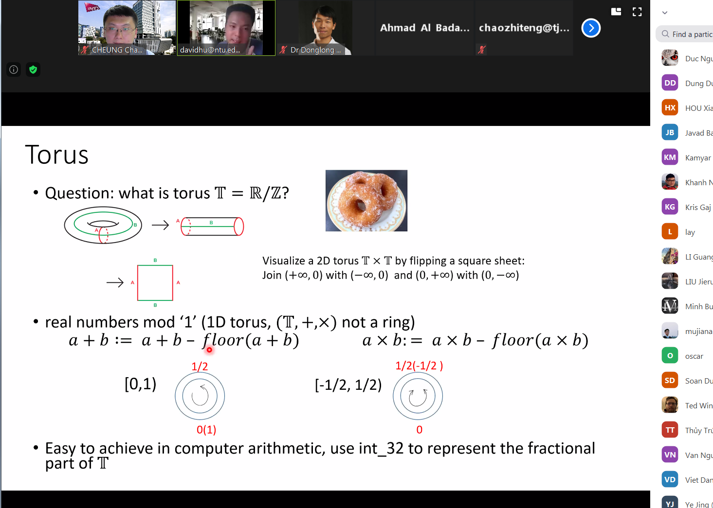
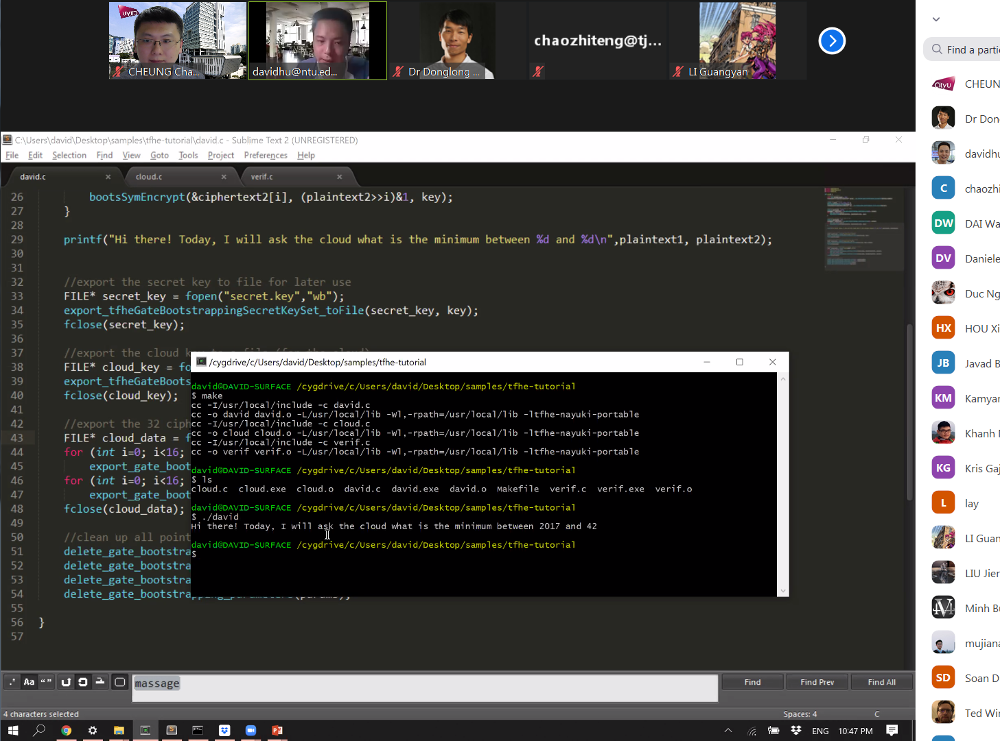

Dr. David Hu has given a nice talk this Tuesday (July 14, 2020) in CALAS Crypto Seminar Series to around 30 international researchers. 
<!--more-->

|  |  |
|-----------------|-----------------|

The topic was “Recent Progress in Fully Homomorphic Encryptions (Part-II)”. The talk included a live demo and was very informative.