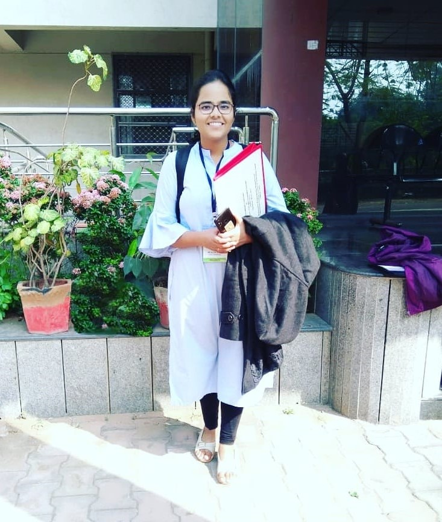

We welcome to team Ajita, a new CALAS PhD Candidate.
<!--more-->

Miss. Ajita Misra received the B.Tech degree in 2018 from SRM University, India in the department of ECE. Later she received her M.Tech. degree in ICT with specialization in VLSI in 2020 from DAIICT, India. She will start the Ph.D. study in CityU EE department in 2020/21.