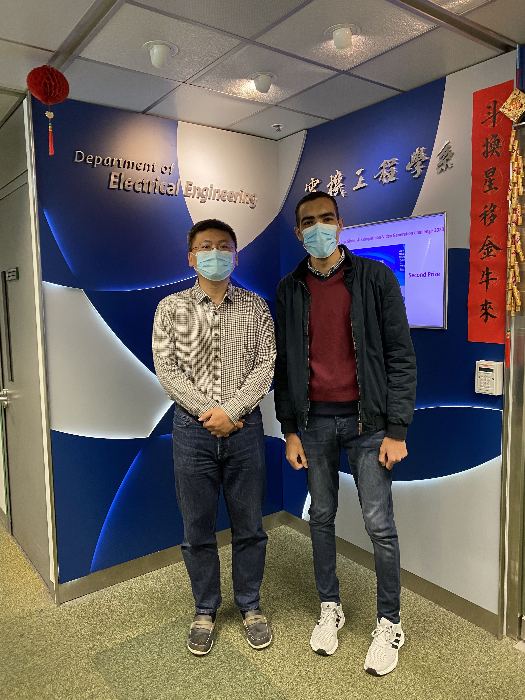

<!--more-->

We warmly welcome Muhammad Ashraf to our team CALAS, who joins CityU as a PhD student. Ashraf is from Egypt.

Mr. Muhammad Ashraf received the B.Sc. degree in Electrical Engineering from Minia university faculty of engineering, Egypt, in 2017. He worked as a teaching assistant for two years and is on leave from the Electrical Engineering department at Minia University, Egypt. He is now a Ph.D. student in the Department of Electrical Engineering, the City University of Hong Kong under the supervision of Professor Hong Yan and Dr. Ray C. C. Cheung.