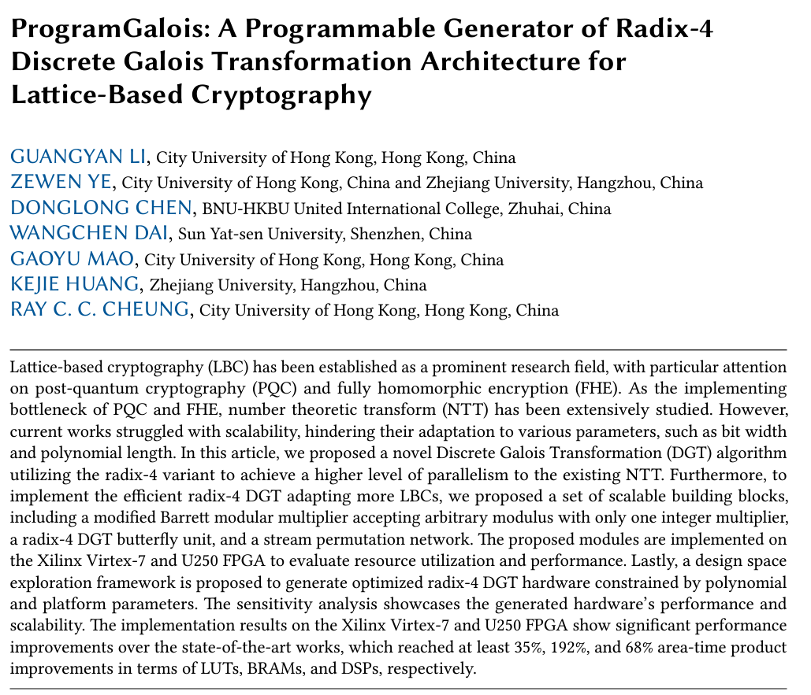

<!--more-->

Many Congratulations to Gavin and Lucas with other members for their paper being published on ACM Transactions on Reconfigurable Technology and Systems (TRETS) recently. Good job! The title of the paper is "ProgramGalois: A Programmable Generator of Radix-4 Discrete Galois Transformation Architecture for Lattice-based Cryptography".