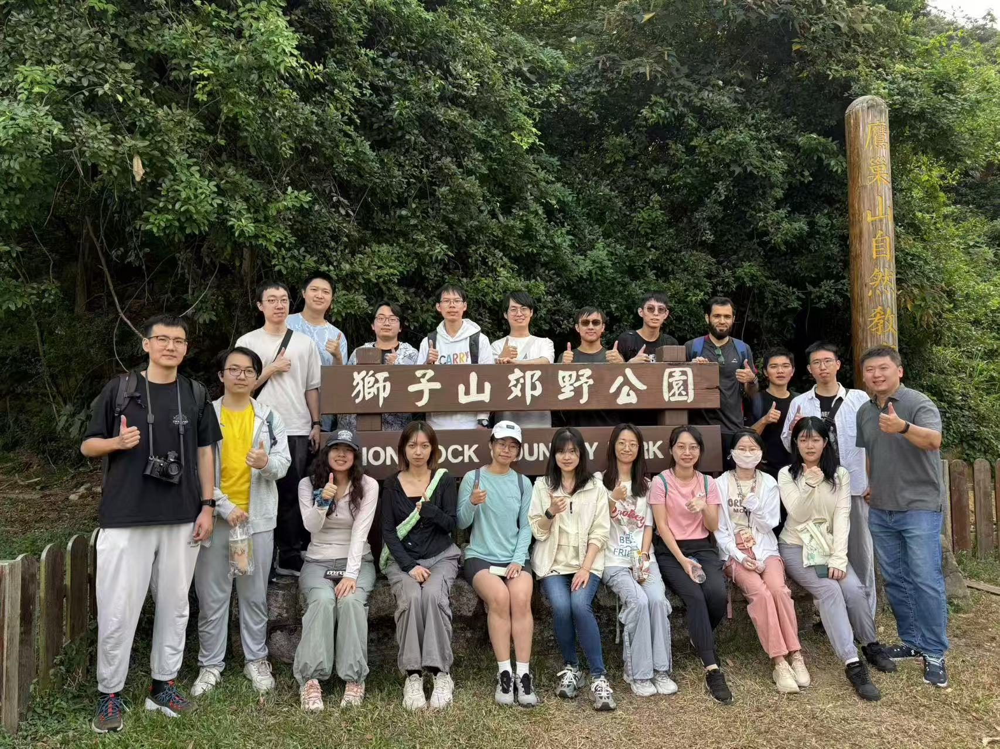
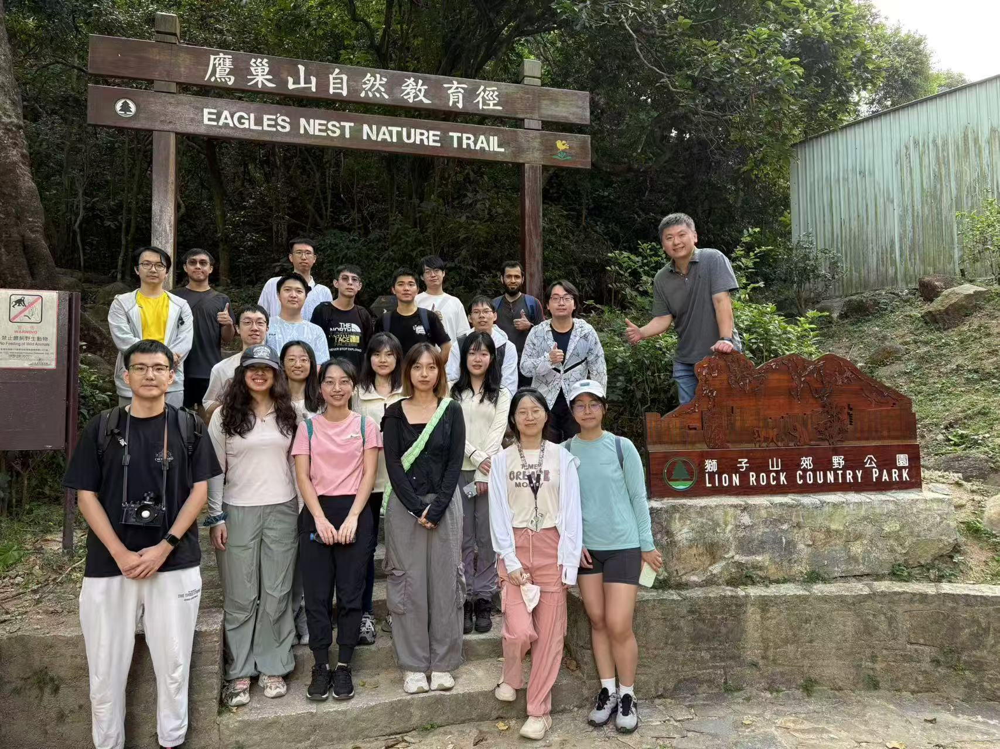
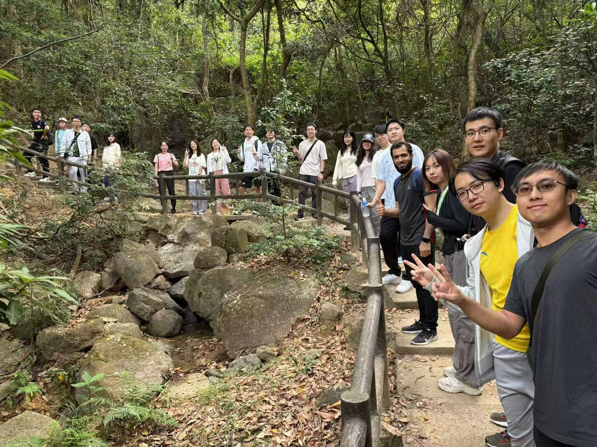
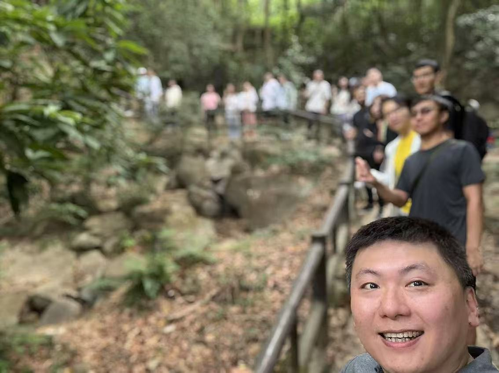
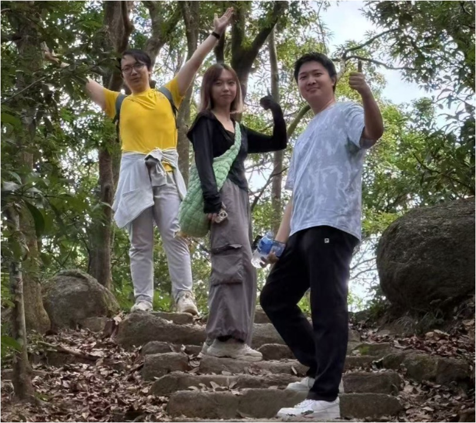
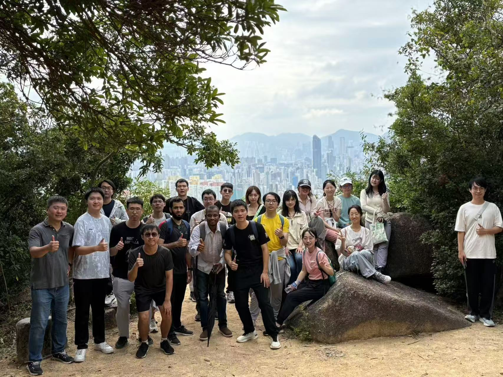

<!--more-->

|  |  |
|-----------------|-----------------|
|  |  |
|  |  |

Our CALAS hiking activity along the Eagle’s Nest Nature Trail was held successfully! Starting at 10 AM, the hike lasted for 1.5 hours, providing a great opportunity for team bonding and knowledge exchange. A special thanks to Clarice, the organizer of this activity, for her efforts in bringing us together. We were also delighted to welcome back Dr. Irfan, our previous PhD graduate, who shared valuable insights from his academic journey. Additionally, it was a pleasure to introduce our new members—Jason and Camilla (new PhD students), Dr. Shen, and Dr. Yang (postdoctoral researchers).

This gathering facilitated meaningful conversations and strengthened connections within the group. Prof. Ray shared exciting updates and opportunities for our PhD students, adding to the motivation of the team. The event concluded with a delightful lunch at a Chinese restaurant, hosted by Prof. Ray. Special thanks to everyone for making this a memorable CALAS gathering!