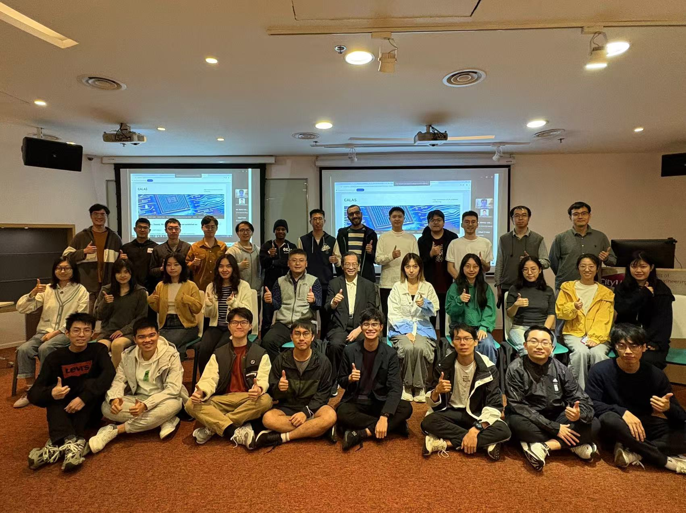
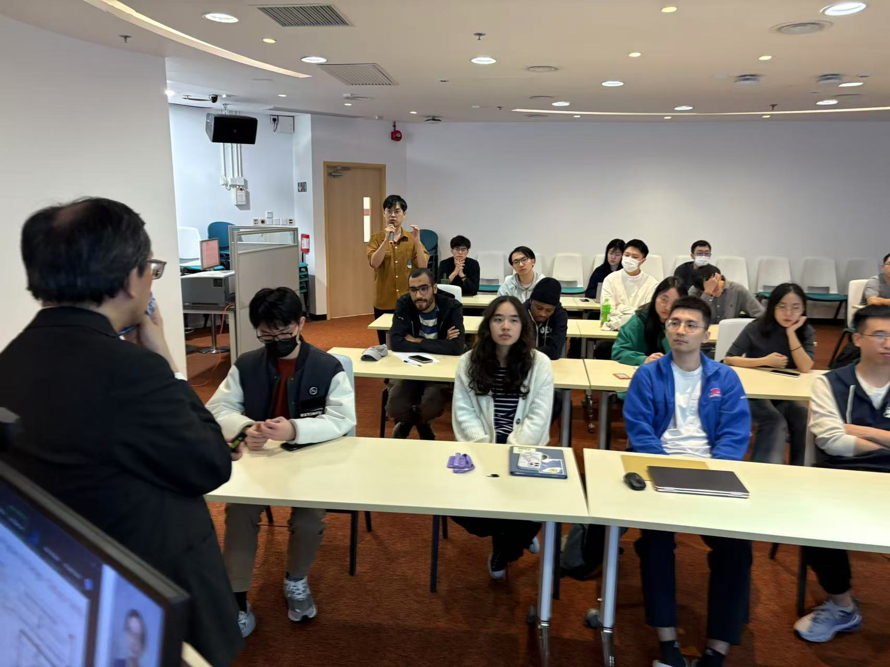
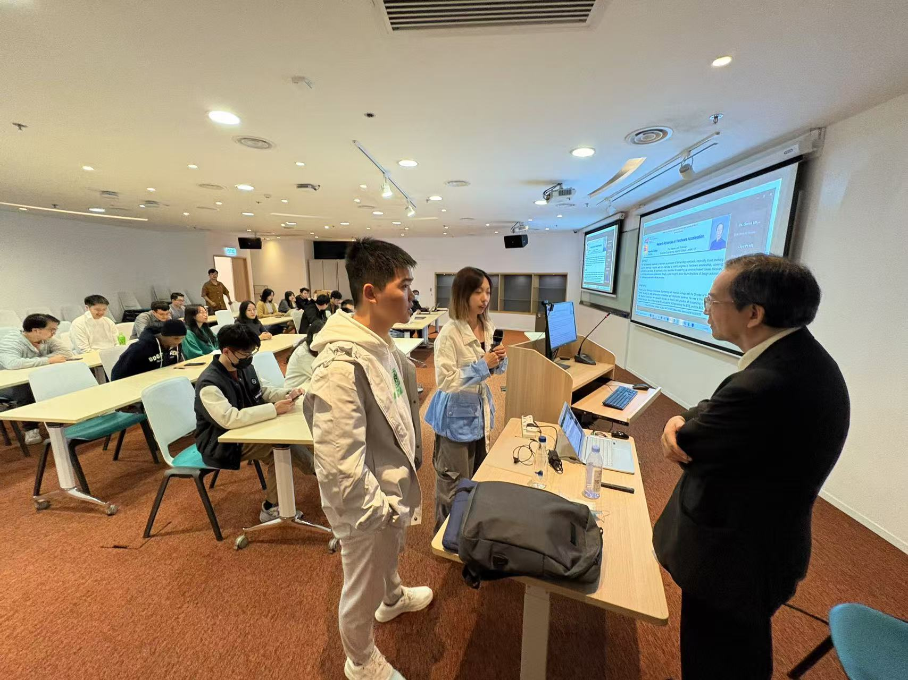
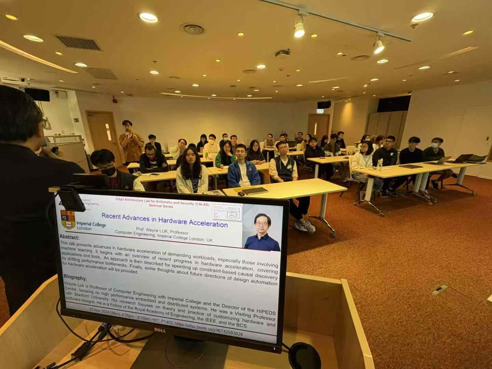
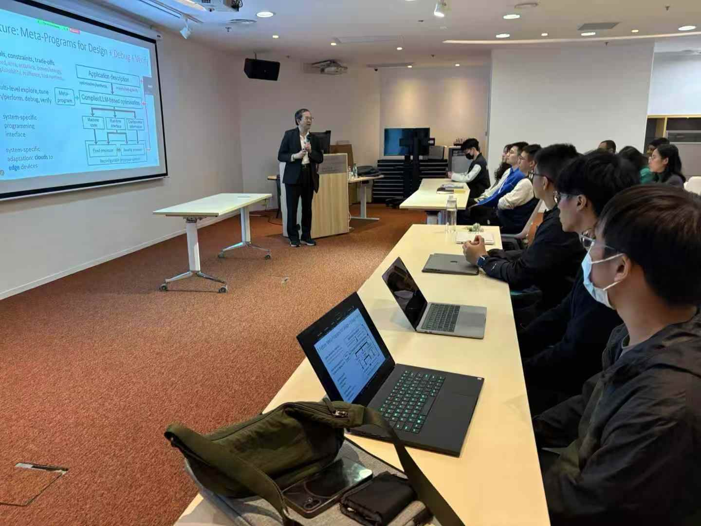
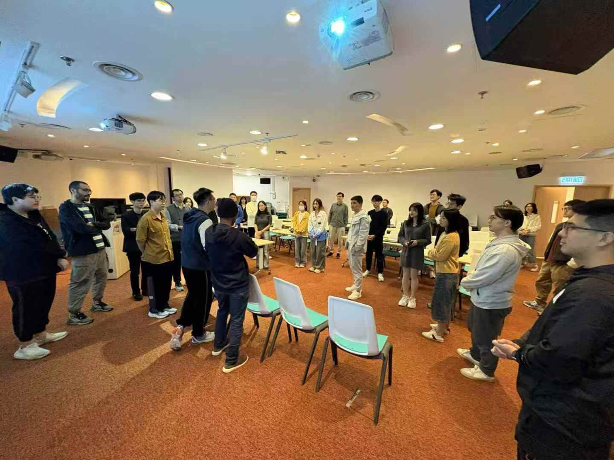

<!--more-->

|  |  |
|-----------------|-----------------|
|  |  |
|  |  |

Yesterday, the CALAS team had the privilege of attending a lecture delivered by Prof. Wayne Luk, a leading expert in meta-programming and hardware acceleration. Prof. Luk shared his recent advancements in leveraging different hardware, including FPGAs, to optimize computational efficiency based on project-specific features. He also introduced groundbreaking work on causal discovery using FPGA-based platforms, which sparked lively discussions and insightful questions from our team.

Prof. Luk, who is also the supervisor of Prof. Ray, highlighted the strong academic lineage of CALAS, tracing its roots to Imperial College London and its current success at CityU. This visit was a valuable opportunity to learn from his expertise, and the enthusiasm shown by CALAS members reflected the spirit of curiosity and collaboration that drives our group forward. Special thanks to Prof. Luk for inspiring us with his innovative research and contributions to our field.