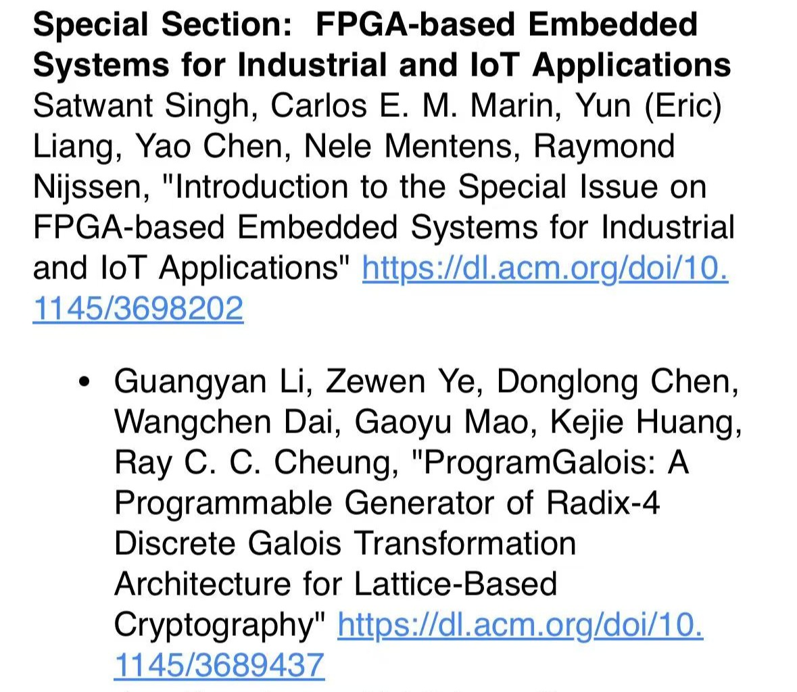

<!--more-->

We are thrilled to see Gavin (Guangyan Li), Lucas (Zewen Ye), Donald (Donglong Chen), Winston (Wangchen Dai) and Gary (Gaoyu Mao)’s outstanding work, titled
*“ProgramGalois: A Programmable Generator of Radix-4 Discrete Galois Transformation Architecture for Lattice-Based Cryptography”*,
featured as part of the Special IoT Section in ACM TRETS (ACM Transactions on Reconfigurable Technology and Systems) Volume 17, Issue 4!

This recognition highlights their contributions to FPGA-based systems for industrial and IoT applications, particularly in advancing lattice-based cryptographic architectures. Kudos to the team for this well-deserved achievement!