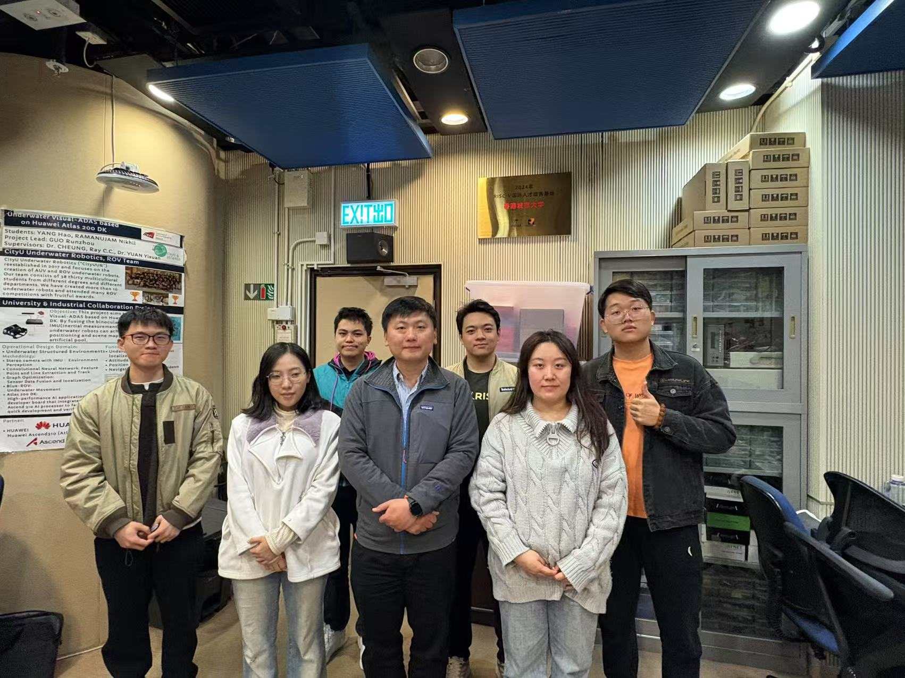
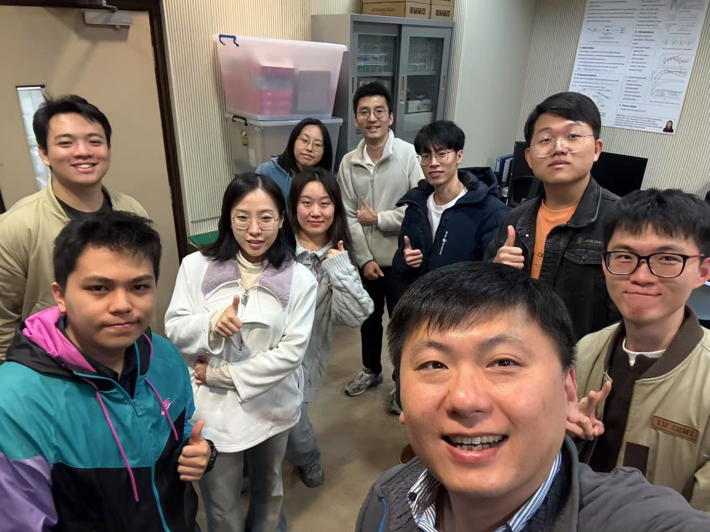
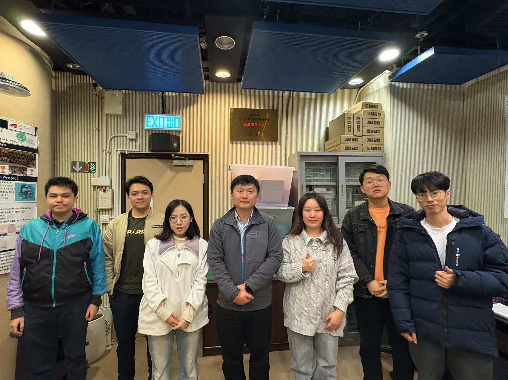

<!--more-->

|  |  |
|-----------------|-----------------|

At the start of the New Year, Prof. Ray dropped by the lab to greet our new master's and undergraduate students, offering guidance and discussing their research plans with warmth and rigor.

A special welcome goes out to Annie, a second-year CDE student who recently completed the Arrow Training at HKSTP. Her passion for IC design is evident, and we are excited to see her grow as part of our team. We also extend gratitude to Claire and Leo for their invaluable support in fostering a collaborative environment.

Prof. Ray’s visit was a testament to his commitment to nurturing students both academically and personally. With his guidance, the CALAS group continues to thrive as a close-knit family, where everyone feels inspired and supported to tackle new challenges together.