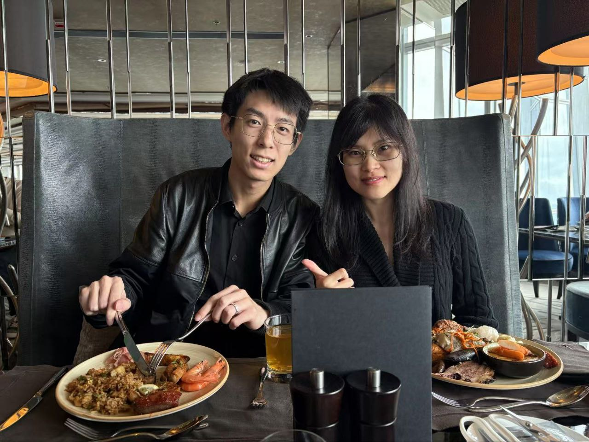

<!--more-->

|  |  |
|-----------------|-----------------|
|  |  |

Prof. Ray’s unwavering support for our research and well-being was on full display during our lunch at Café 103 in The Ritz-Carlton. Over a spread of succulent dishes, he inquired about our ongoing projects, offered invaluable guidance, and showed genuine concern for the challenges of living in Hong Kong, especially for couples navigating life here. With panoramic views of the bay’s green waters from the lofty vantage, we truly felt inspired.

He reminded us that opportunities abound in this dynamic city, fueling everyone’s motivation to move forward. The uplifting feedback and spectacular environment recharged our energy for the next phase of research and collaboration. Each encouraging word reminded us that, with Prof. Ray’s mentorship and the CALAS family’s support, we can transform challenges into victories. Let’s continue striving for excellence and make 2025 another milestone year for CALAS!