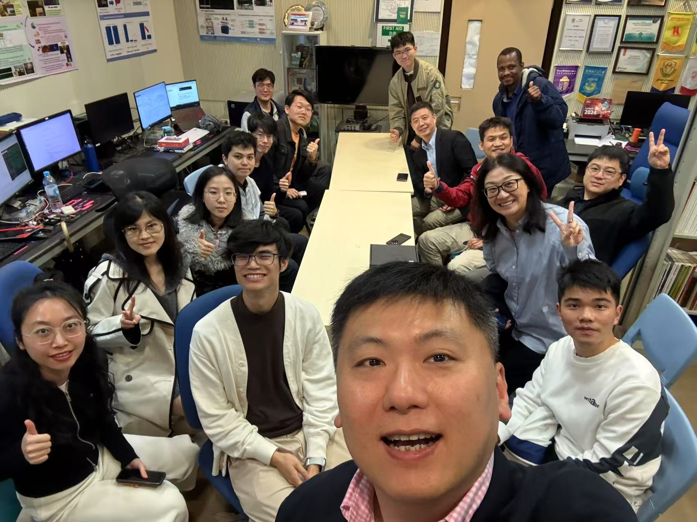
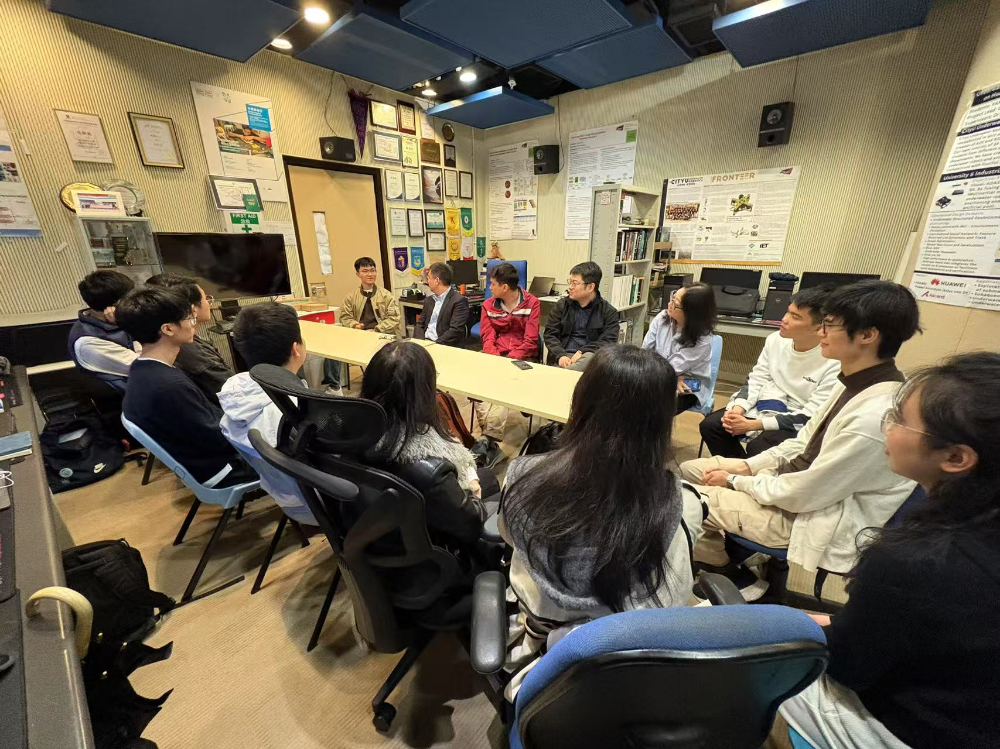

<!--more-->

|  |  |
|-----------------|-----------------|

On March 6, 2025, at 4:30 pm, we had the pleasure of hosting a distinguished delegation from StarFive—comprising their leader, technical expert, market researcher, and HR—at our CALAS lab. During their visit, we showcased our ongoing research in cryptography hardware and highlighted our latest breakthroughs in RISC-V architecture and security defense.

StarFive representatives shared invaluable insights into their extensive RISC-V development experience, shedding light on the company’s plans to establish a division in Hong Kong geared toward nurturing next-generation hardware talent. Their openness to innovative collaborations resonated strongly with our team’s passion for cutting-edge research. Notably, Candice engaged in fruitful discussions with the delegation, given her coinciding research interests in RISC-V. This exchange sparked lively conversations on potential joint ventures, including the integration of academic research with StarFive’s forward-looking industrial ambitions.

We are looking forward to cultivating a deeper partnership, bridging the gap between technological innovation and real-world impact for both academia and industry.