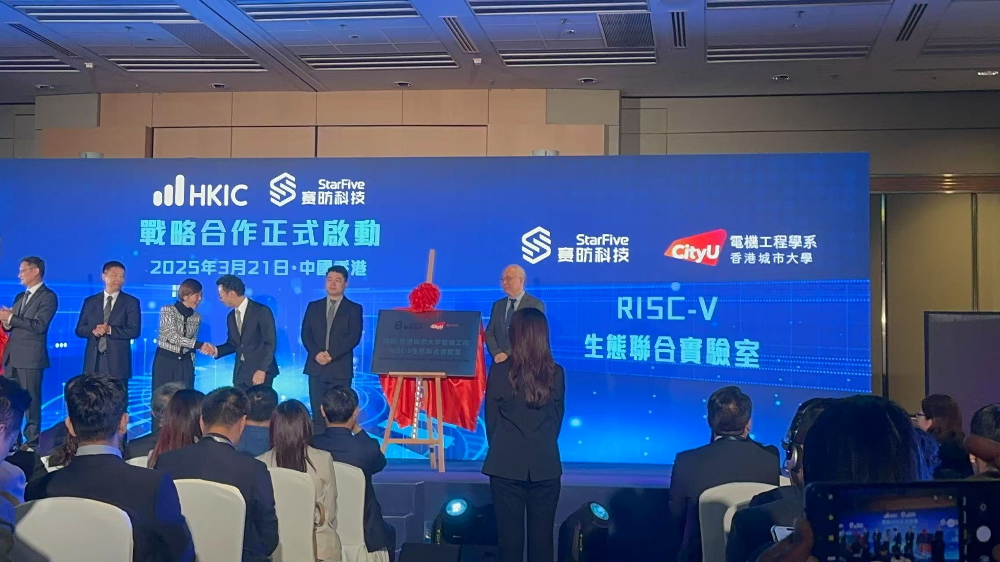
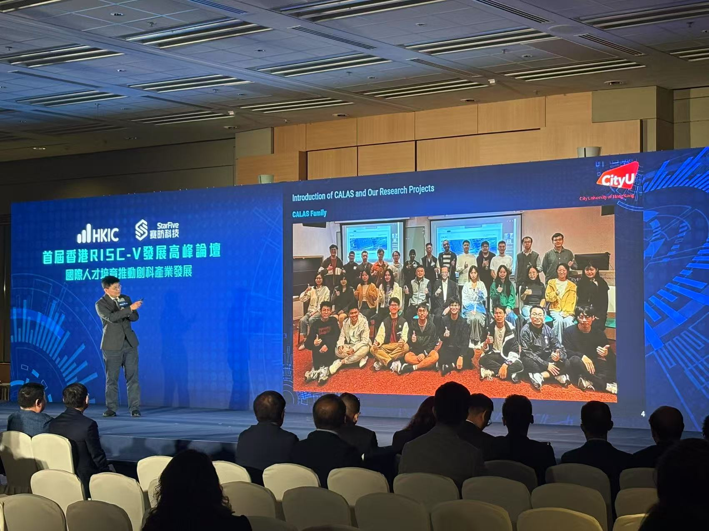

<!--more-->

  

    
  

  

    
  

  

    
  

  

Following our initial hosting of StarFive representatives on March 6, we are delighted to announce the formal establishment of the "StarFive-CityUHK EE RISC-V Ecosystem Joint Laboratory" in partnership with Hong Kong Investment Management Co., Ltd. (HKIC). This milestone was celebrated at the inaugural Hong Kong RISC-V Development Summit Forum on March 21, 2025, where our CALAS research group was prominently featured.

During the ceremony, Professor Ray presented CALAS's expertise in RISC-V development, highlighting our lab's contributions to computer architecture innovation and security research. The presentation included an introduction to our CALAS family and ongoing research projects, demonstrating our readiness to lead in this strategic partnership.

The joint laboratory will serve as a critical platform for combining academic research with industrial applications, particularly leveraging CALAS's strengths in cryptography hardware and RISC-V architecture. As a team member noted, "RISC-V democratizes microchip development just as Deepseek did to AI. CALAS has a big role to play in this StarFive Hong Kong adventure."

This collaboration represents a significant step in Hong Kong's semiconductor ecosystem development, creating unprecedented opportunities for our researchers and students to engage with cutting-edge RISC-V technologies. We extend our gratitude to Professor Ray and Professor Patrick for their commendable efforts in establishing this partnership, and to StarFive for their commitment to fostering innovation in Hong Kong's technology landscape.

We look forward to advancing RISC-V research and applications through this newly formed joint laboratory, bridging academic excellence with industrial implementation.