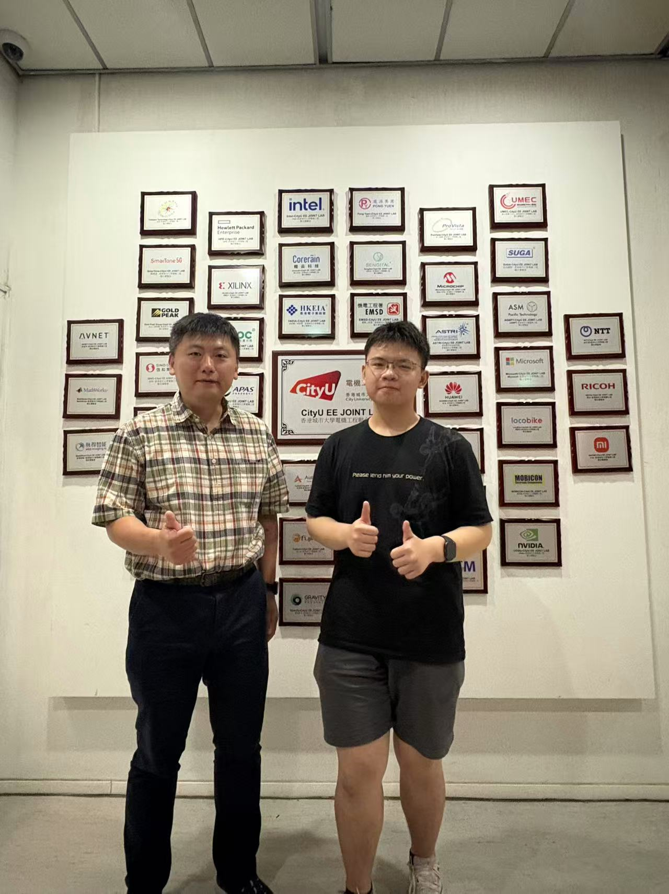
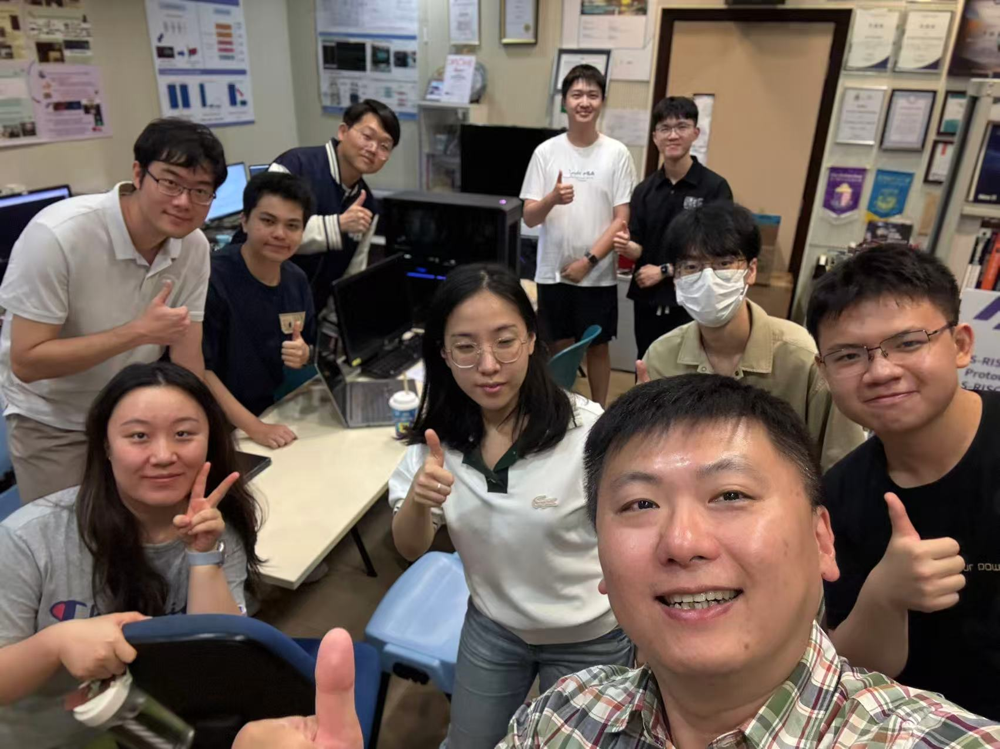

We are excited to welcome Peter from the University of Toronto who will be joining our CALAS lab as a summer intern for the next 9 weeks!
<!--more-->

  

    
    
Prof. Ray welcomes Peter in front of our industry partnerships showcase

  

  

    
    
Our diverse and dynamic CALAS lab team - fostering international collaboration

  

Our lab thrives on its vibrant international atmosphere, bringing together brilliant minds from around the world to collaborate on cutting-edge research. As you can see from our industry partnership wall and our diverse team, we believe that great innovation happens when different perspectives and cultures come together.

Peter's arrival adds another exciting dimension to our already bustling lab environment. As Prof. Ray mentioned, our lab is busy and dynamic, and we hope to see rich interactions and mutual learning among all team members during Peter's time with us.

We look forward to the fresh insights and energy Peter will bring from UT, and we're confident this will be a rewarding experience for everyone involved. Welcome to the team, Peter!
