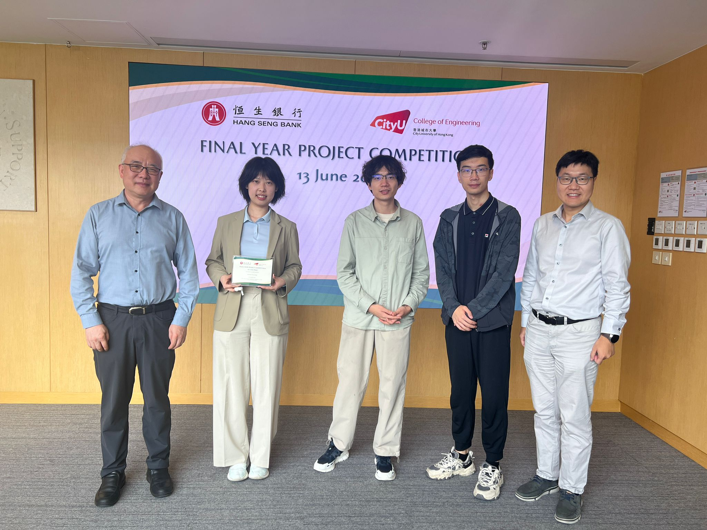
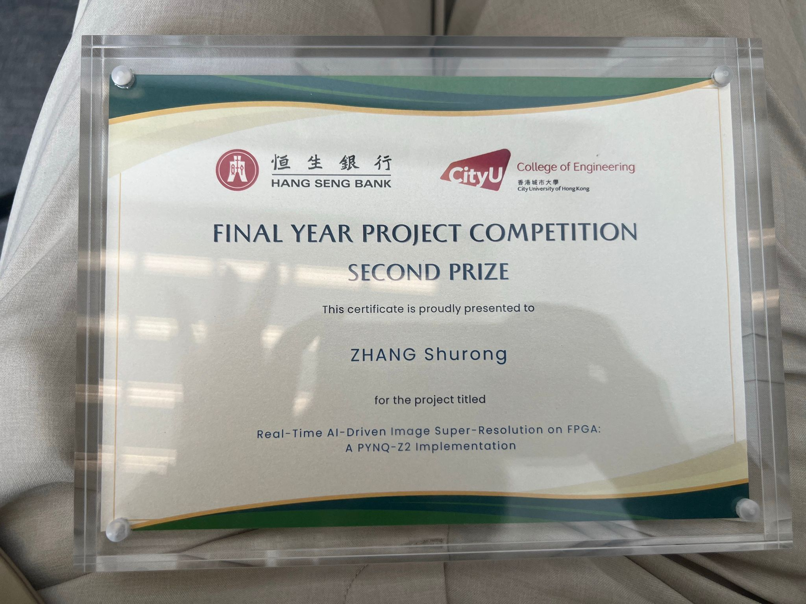

We are thrilled to announce that Alice has won the 2nd Prize (HK$20,000) in the Final Year Project Competition 2024-25 from the College of Engineering!
<!--more-->

 
 
-----------------

This prestigious competition recognizes outstanding final-year projects that demonstrate innovation and address pressing environmental challenges in the areas of Innovation, Green Energy, and Sustainability.
Alice's exceptional work was expertly supervised by Prof. Ray and Prof. Edwin Pun, whose guidance and mentorship helped bring this project to success.
This achievement reflects not only Alice's dedication and innovative thinking but also the collaborative excellence of our research community. Her project represents the kind of creative problem-solving and research excellence that the College of Engineering strives to foster.
Please join us in congratulating Alice on this well-deserved recognition! 