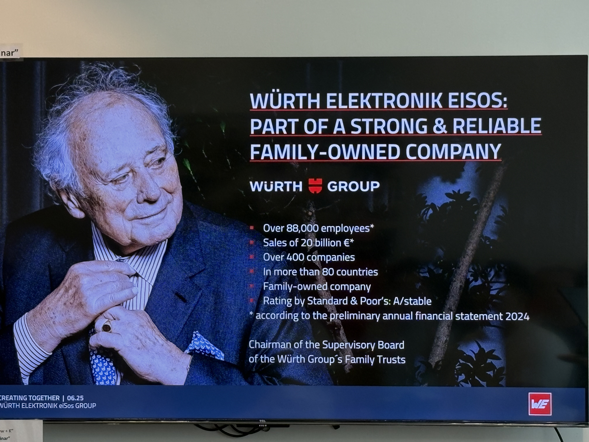

What an incredible day for our CityUHK EE EdgeAIoTM Gifted Programme students!
<!--more-->

|  |  |
|-----------------|-----------------|

Yesterday, June 26th, our talented group had the extraordinary opportunity to visit the state-of-the-art cleanroom facilities at Hong Kong Science & Technology Park. This wasn't just any ordinary field trip - our students got hands-on exposure to real chip manufacturing environments and learned directly from industry professionals.

Our visit was packed with amazing experiences as we explored the cutting-edge cleanroom at HKSTP Sensor Lab and visited the Wurth Electronics Office. Students gained invaluable insights into microchip manufacturing processes while networking with professionals in the semiconductor industry. They experienced firsthand the precision and technology behind modern electronics, seeing the meticulous processes required in chip fabrication and observing advanced equipment in action.

The excitement on our students' faces says it all! This visit perfectly complemented our EdgeAIoTM curriculum by bridging the gap between classroom theory and industry practice. Real-world experiences like these are what make our programme truly special, giving students the opportunity to see how theoretical concepts translate into cutting-edge technology applications.

A huge thank you to Hong Kong Science & Technology Park for hosting us and providing this amazing learning opportunity. These hands-on experiences are invaluable for our students as they prepare to become the next generation of engineers and innovators. Our future engineers are getting ready to shape tomorrow's technology!