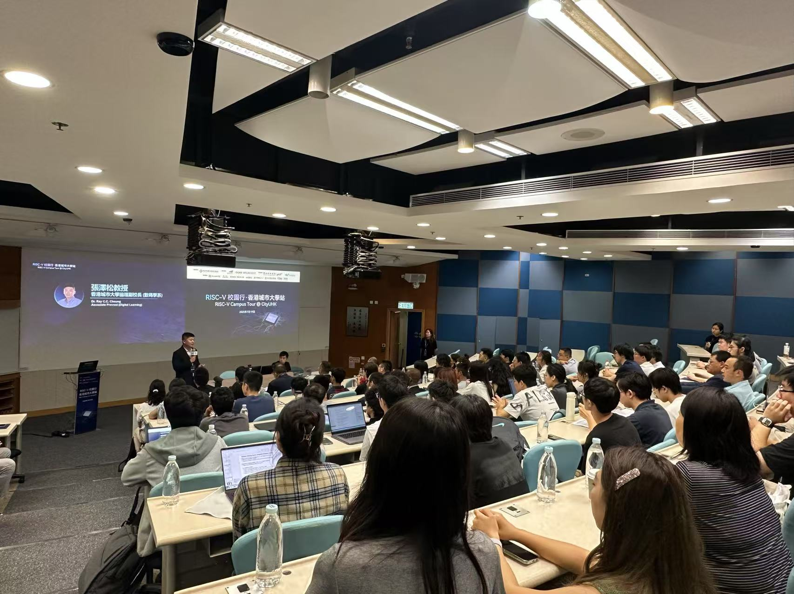
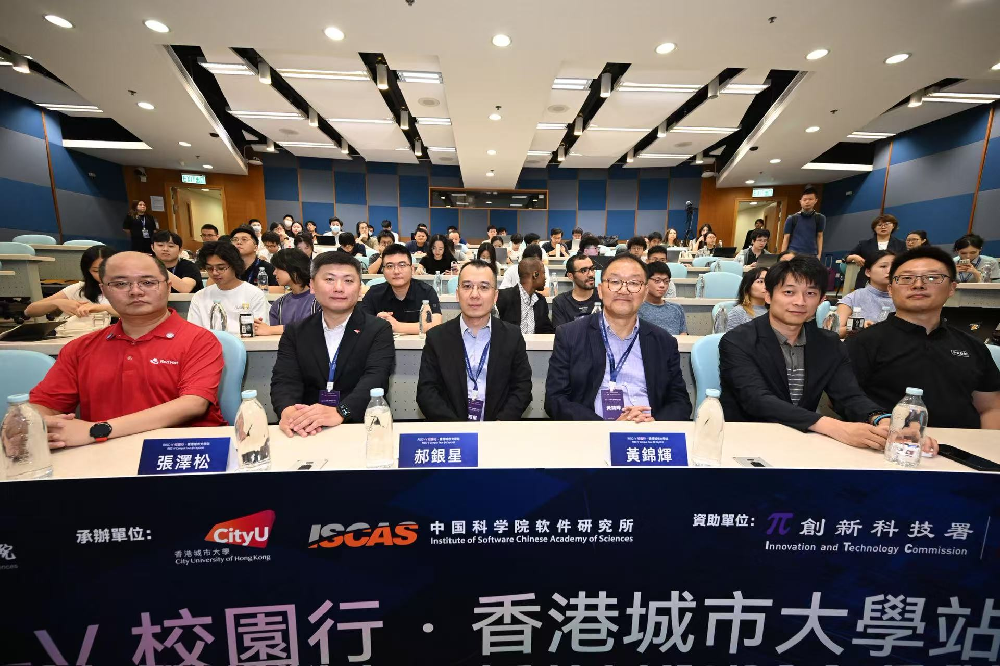

We are thrilled to celebrate CALAS's active participation in the RISC-V Campus Tour held at CityUHK on Saturday, July 19th!
<!--more-->

|  |  |
|-----------------|-----------------|

This exceptional event perfectly aligned with our laboratory's specialization in RISC-V architectures and software/hardware co-design research.

Professor Ray Cheung, our esteemed Associate Provost (Digital Learning) and CALAS leader, served as a key co-organizer of this significant initiative, bringing together the Chinese Academy of Sciences (HK Innovation Institute) and CityUHK to advance open-source processor innovation. The event featured comprehensive presentations on the global RISC-V software ecosystem and hands-on workshops including the intensive "One Student One Chip – One-Hour Quick Start" session.

Our CALAS community actively engaged with industry experts, exploring practical pathways into international open-source communities and learning about opportunities like the Jiachen 2025 Open-Source Internship Programme. This event beautifully complemented our ongoing research in cryptographic hardware acceleration, AI hardware design using FPGA platforms, and embedded system development for IoT applications.

The tour reinforces CALAS's commitment to bridging cutting-edge theoretical research with practical hardware implementations, positioning our students and researchers at the forefront of the open-source revolution that's reshaping modern computing architectures.