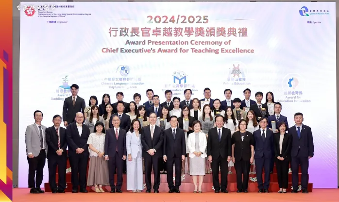
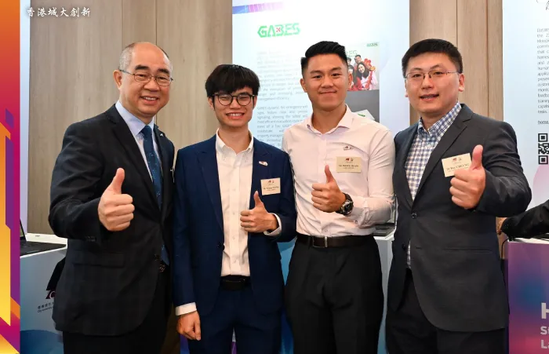

We are thrilled to celebrate Prof. Ray C.C. Cheung's outstanding achievement as Chairman of the Innovation in Education Award evaluation panel for the Chief Executive's Award for Teaching Excellence (2024/2025)! 
<!--more-->

 
 
-----------------
This prestigious government recognition highlights his exceptional expertise in innovative education and technology integration.

Prof. Cheung, Associate Provost (Digital Learning) at City University of Hong Kong and Professor in both Electrical Engineering and Computer Science departments, played a crucial role in selecting teachers who demonstrate professional excellence, innovative spirit, and effective use of technology to enhance teaching outcomes. The award ceremony, held on July 4th with Chief Executive John Lee as guest of honor, recognized teachers across primary, secondary, kindergarten, and special schools.

Prof. Cheung expressed his honor in witnessing how teachers "not only impart knowledge but actively use innovative thinking and research technology to inspire students' creativity and exploratory spirit." His commitment to promoting education-technology integration continues as he will serve again as an evaluation committee member for the 2025/2026 awards.

This recognition perfectly complements his role in guiding HK Tech 300 startups and his dedication to fostering innovation in education!