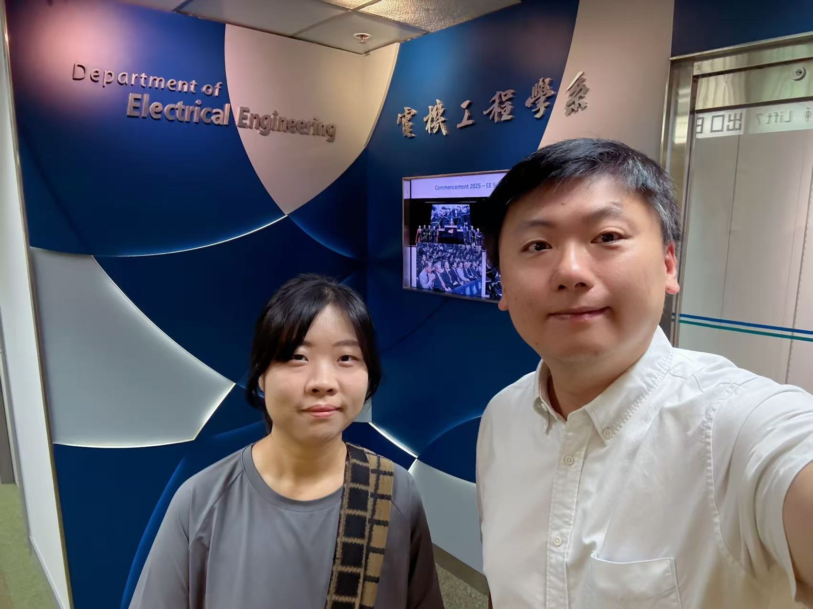
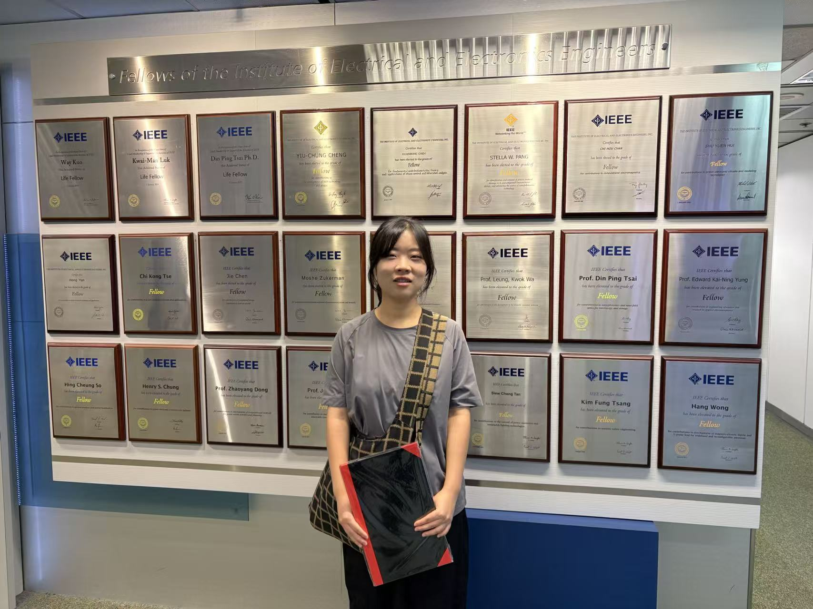

We are delighted to have Zoe begin her journey as a Ph.D. candidate, who has received her BEng degree from Tsinghua University, Beijing in 2019, followed by her MSc degree from Georgia Institute of Technology, Atlanta in 2021—achieved with full marks! 
<!--more-->

|  |  |
|-----------------|-----------------|

Welcome Zoe begin her journey as a Ph.D. candidate under the supervision of Prof. Ray C. C. Cheung, with Prof. Patrick Hung serving as her co-supervisor.

Zoe brings an impressive academic foundation to our team, having received her BEng degree from Tsinghua University, Beijing in 2019, followed by her MSc degree from Georgia Institute of Technology, Atlanta in 2021—achieved with full marks, demonstrating her exceptional dedication to academic excellence.

Prof. Ray had the pleasure of showing Zoe around the campus this morning, and we're thrilled that she's excited to meet and collaborate with our CALAS members. As she settles into our research community, we encourage her to connect with our fellow students, including Yile, Shiyu, and Sanka, who will undoubtedly be valuable colleagues in her doctoral journey.

Welcome to the CALAS big family, Zoe! We look forward to the innovative contributions you'll bring to our research endeavors and the collaborative spirit that makes our lab such a dynamic place to advance the frontiers of architecture, arithmetic, and security.