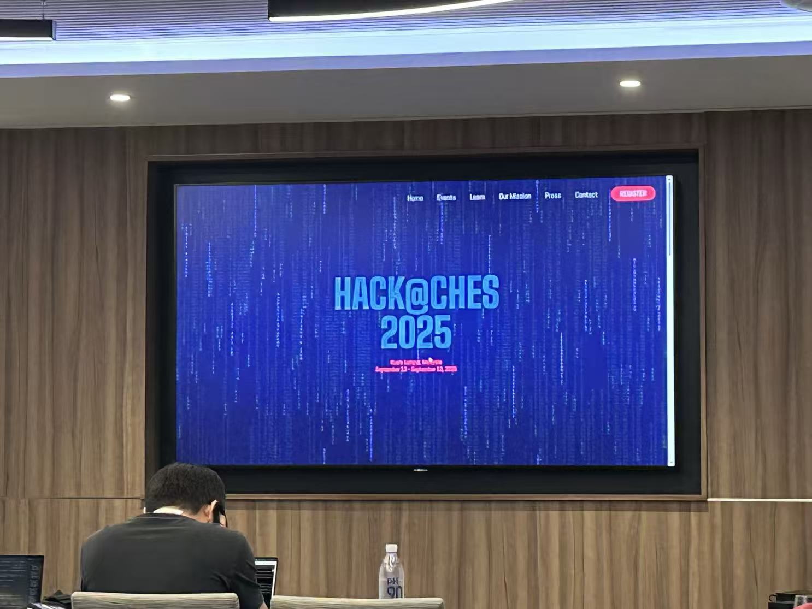

Team GhostInTheCipher from CALAS successfully qualifies for the prestigious Phase 2 of Hack@CHES 2025, competing alongside global teams in cryptographic hardware security challenges at CHES 2025 in Kuala Lumpur.
<!--more-->

|  |  |
|-----------------|-----------------|

We are proud to announce that Team GhostInTheCipher from CALAS has successfully advanced to Phase 2 of the highly competitive Hack@CHES 2025 competition. This prestigious cryptographic hardware security challenge attracts top teams worldwide to identify vulnerabilities in cutting-edge cryptographic implementations. 

Our talented team comprises Hao Yang, Shiyu Shen, Shutong Jin, and Wenjie Zhang, who have demonstrated exceptional skills in cryptographic analysis and hardware security research. Their advancement to Phase 2 places them among the elite teams competing at the highest level of this international competition. 

The Phase 2 competition will take place in conjunction with the CHES 2025 conference in Kuala Lumpur, Malaysia, from September 13-15, 2025. The team will participate in intensive in-person sessions, experience sharing workshops, and industry collaboration events, providing valuable opportunities to engage with leading experts in cryptographic engineering and hardware security. 

This achievement reflects CALAS's commitment to excellence in cryptographic research and hardware security innovation. The Hack@CHES competition directly aligns with our laboratory's focus on developing secure arithmetic architectures and advancing the field of cryptographic hardware design. 

We look forward to following their continued progress in this challenging competition!