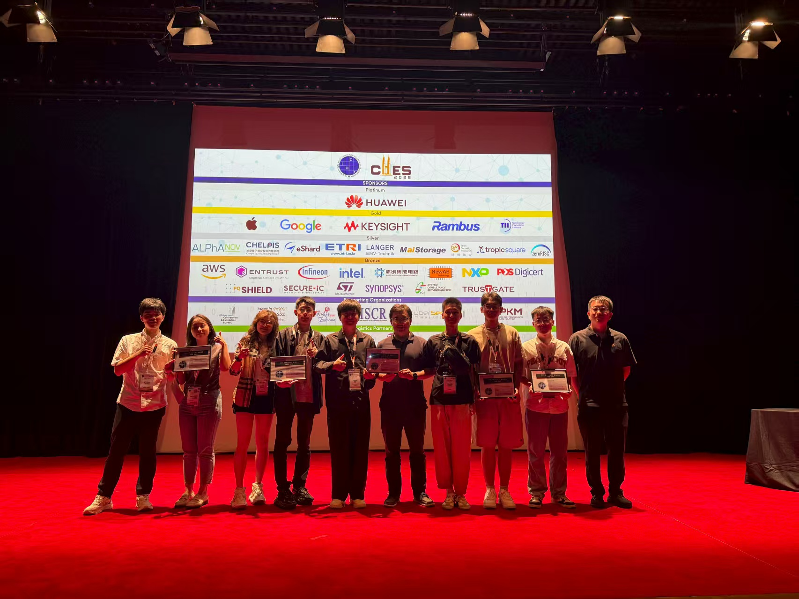
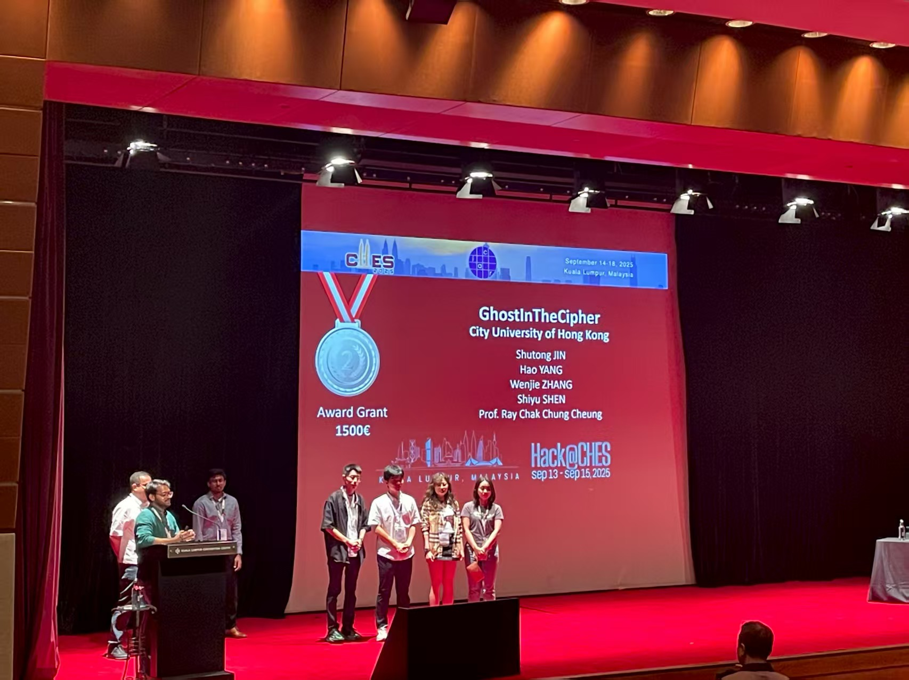

CALAS team achieves outstanding second place finish among nine international teams at the world's largest hardware security competition, HACK@CHES25, held in conjunction with the premier CHES conference in Kuala Lumpur, Malaysia.
<!--more-->

|  |  |
|-----------------|-----------------|

We are absolutely thrilled to congratulate our outstanding CALAS team for securing second place at HACK@CHES25, the world's largest and most prestigious hardware security competition! This remarkable achievement brings honor to Hong Kong and demonstrates the exceptional caliber of our research excellence.

Our stellar team comprised of PhD students and postdoctoral researchers Shutong Jin, Wenjie Zhang, Dr. Shiyu Shen and Dr. Hao Yang, traveled to Kuala Lumpur, Malaysia, to compete at this elite hardware security challenge co-located with CHES 2025, the premier Conference on Cryptographic Hardware and Embedded Systems.

HACK@CHES represents the pinnacle of hardware security competitions, bringing together the brightest minds from academia and industry worldwide. Teams were challenged to analyze Google's OpenTitan SoC design with deliberately implanted vulnerabilities, requiring participants to identify security flaws, develop practical exploits, and propose robust mitigations.

Achieving silver medal honors among nine international teams underscores CALAS's leading position in hardware security research and cryptographic engineering. This victory reflects our commitment to advancing the frontiers of secure hardware design and embedded systems security.

Congratulations to all team members for this exceptional achievement!