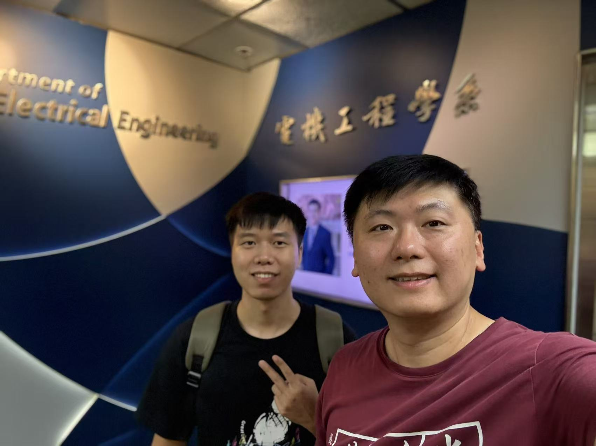

Dr. Joshua, a PhD graduate of Prof. Donald, returns to CALAS as a postdoctoral researcher, bringing valuable expertise and fresh perspectives to our team beginning January 10th.
<!--more-->

A warm CALAS welcome goes out to Dr. Joshua, who rejoins our research family as a returning postdoctoral researcher on January 10th! We're thrilled to have him back.

Dr. Joshua brings exceptional credentials as a PhD graduate of Prof. Donald, and his return to CALAS represents an exciting opportunity for continued collaboration and innovation. His previous experience with our team, combined with the advanced research skills developed during his doctoral studies, positions him perfectly to contribute to our ongoing projects in cryptographic hardware and secure system design.

The enthusiasm expressed by our team members reflects the high regard in which Dr. Joshua is held. His return demonstrates the strong collaborative spirit and supportive research environment that CALAS fosters, where talented researchers choose to advance their careers alongside colleagues who value excellence and innovation.

We look forward to the fresh perspectives and expertise Dr. Joshua will bring to our laboratory as we continue pushing the boundaries of arithmetic and security research together!