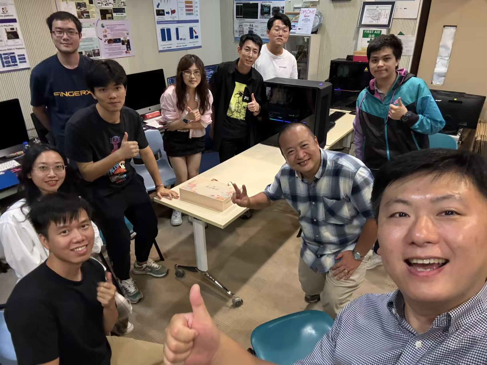
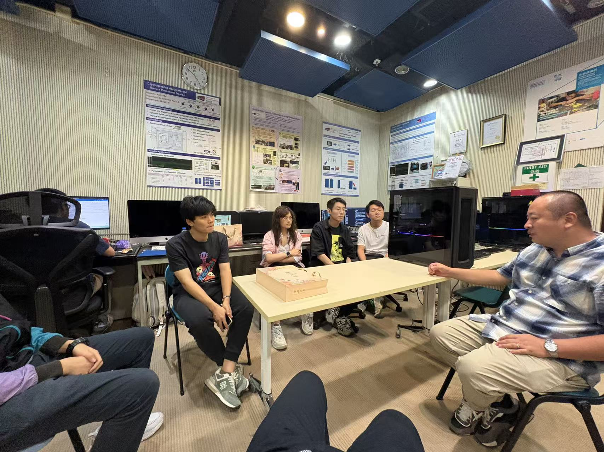

Dr. Kuen Hung (Brittle) Tsoi, CALAS advisor and founder of Corerain Technologies, visited the laboratory to share invaluable industry insights and career guidance with our research team.
<!--more-->

|  |  |
|-----------------|-----------------|

We're honored to have hosted Dr. Kuen Hung (Brittle) Tsoi for an enriching mentorship session with our CALAS research family! As a valued advisor to our laboratory and Prof. Ray's former junior student at CUHK, Dr. Tsoi brings exceptional expertise bridging academia and industry.

Dr. Tsoi's remarkable journey—from his CUHK graduation through a four-year postdoctoral period and his tenure at Imagination AI, to founding Corerain Technologies—offers inspiring insights for our young scholars. His company, now employing approximately 300 staff in Shenzhen, stands as a testament to successful technology entrepreneurship in AI and FPGA acceleration.

During this engaging afternoon session, Dr. Tsoi generously shared his experiences and provided valuable career guidance, emphasizing the importance of seizing learning opportunities and continuous self-improvement. His perspective on transitioning from academic research to industry leadership resonated deeply with our team.

We're grateful for Dr. Tsoi's ongoing mentorship and his commitment to empowering the next generation of researchers and innovators!