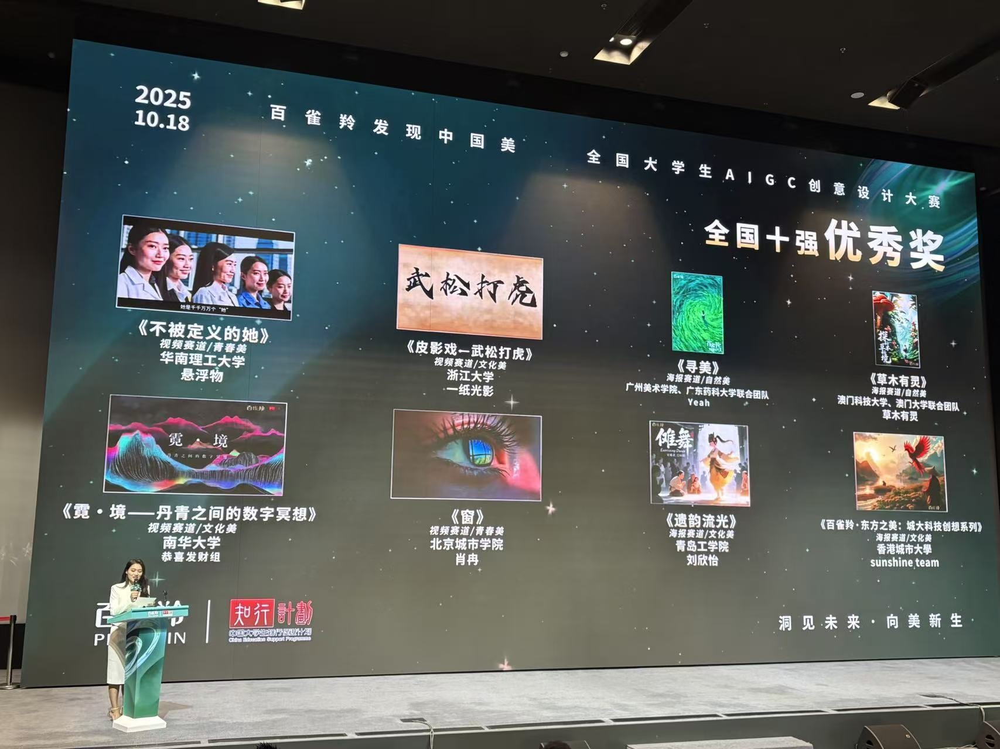

We're celebrating Ken Mochizuki and Sunny's outstanding achievement in securing a National Top 10 Excellence Award at the prestigious Pechoin "Discover the Beauty of China" National College Students AIGC Creative Design Competition!
<!--more-->

|  |  |
|-----------------|-----------------|
|  |  |

Competing as part of the CityUHK "sunshine team," Ken and Sunny's creative work titled "Pechoin · Oriental Beauty: CityU Technology Creative Series" stood out among entries from over 300 universities nationwide, involving 300,000 students across China. This national competition, held on October 18, 2025, challenges students to integrate AIGC technology with traditional Chinese aesthetics across three themes: Natural Beauty, Cultural Beauty, and Youth Beauty.

Their innovative approach to blending AI-generated content with cultural elements demonstrates CALAS's commitment to advancing creative technology applications. This achievement reflects the interdisciplinary excellence fostered at our laboratory, where technical innovation meets artistic expression.

Congratulations, Ken and Sunny, on this well-deserved recognition at this prestigious national competition! Your creative excellence continues to elevate CALAS's reputation in computational design and AI-powered creativity.