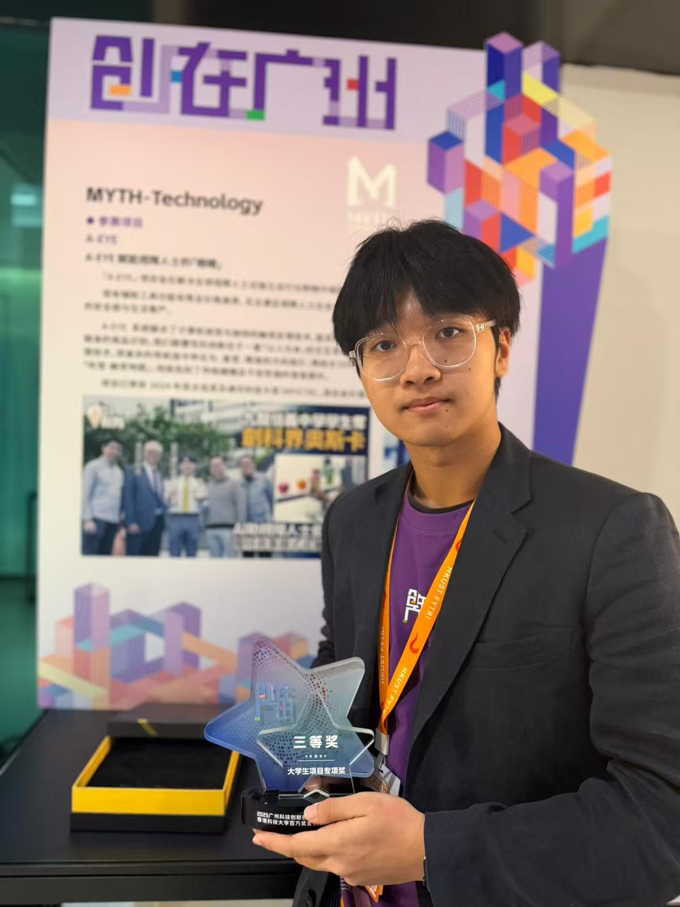

Excellence has been recognized as year-one freshman Ken Mochizuki secures a Grand Third Prize at the Guangzhou Science and Technology Innovation and Entrepreneurship Competition!
<!--more-->

Ken's remarkable achievement in this prestigious competition, which is part of the 14th China Innovation and Entrepreneurship Competition (Guangdong · Guangzhou Division), demonstrates exceptional entrepreneurial spirit and innovation capabilities at an early stage of his academic journey. The competition attracts hundreds of innovative projects across multiple technology sectors, making this recognition particularly impressive for a first-year student.

This accomplishment reflects Ken's proactive approach to learning and his ability to translate academic knowledge into practical innovation. As Prof. Ray noted, it's inspiring to see young talents actively shaping and guiding their learning paths from the very beginning of their university careers. Ken's success exemplifies the entrepreneurial mindset and hands-on innovation culture fostered at CALAS, where students are encouraged to pursue ambitious projects regardless of their academic year.

Congratulations, Ken, on this outstanding early achievement! Your entrepreneurial drive and innovative thinking set a strong foundation for your academic journey ahead.