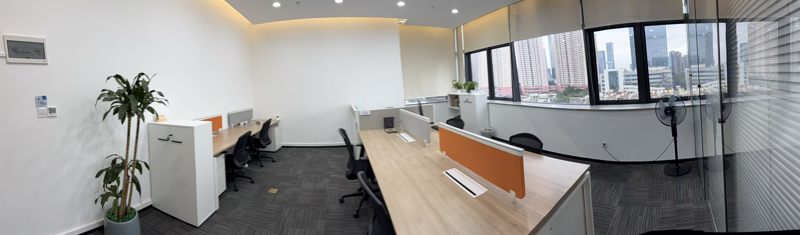

Expanding our research horizons, CALAS is proud to announce the establishment of a joint laboratory with Inspur Group at Shenzhen NanShan Science Park. 
<!--more-->

This exciting collaboration marks a significant milestone in advancing research excellence through industry-academic partnership. Members of our team visited the new facility this Wednesday to begin operations in this state-of-the-art research environment. The joint laboratory will serve as a dynamic platform for collaborative innovation, bringing together CALAS's expertise in hardware security and cryptographic systems with Inspur Group's industry-leading capabilities. We look forward to the groundbreaking research and development that will emerge from this partnership!