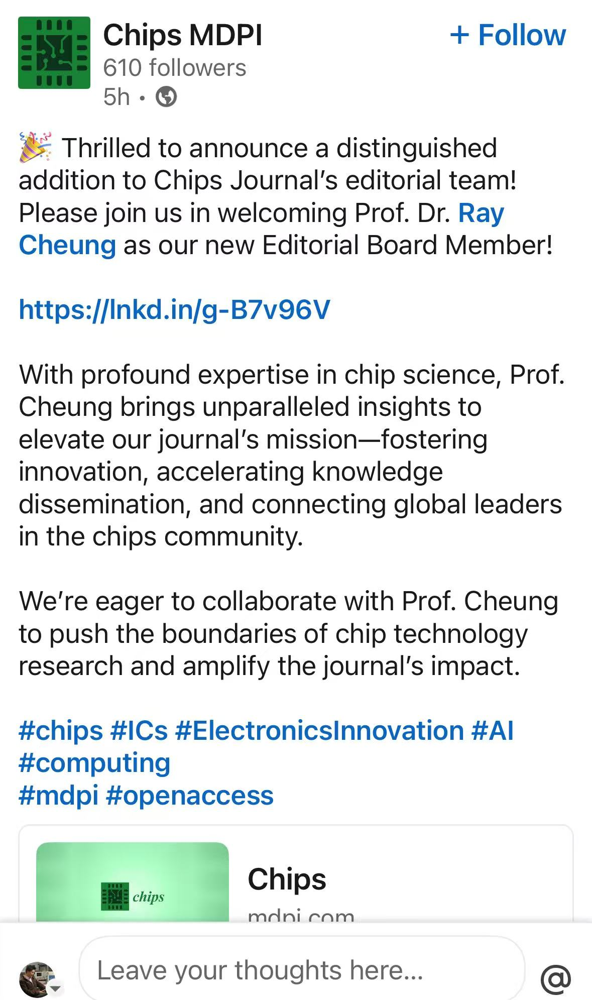

It brings us great pleasure to share that Prof. Dr. Ray C.C. Cheung has been appointed as an Editorial Board Member for Chips Journal, published by MDPI!  
<!--more-->

This distinguished recognition highlights Prof. Cheung's exceptional contributions and profound expertise in chip science and technology.

As a leading figure in hardware acceleration, cryptographic systems, and RISC-V architectures, Prof. Cheung brings invaluable insights to this emerging open-access journal. His appointment will help shape the journal's mission of fostering innovation, accelerating knowledge dissemination, and connecting global leaders in the chips community.

Chips Journal focuses on cutting-edge research in integrated circuits, electronics innovation, AI computing, and related fields—areas that align perfectly with CALAS's research strengths. We encourage our team members to explore this new venue for their research contributions and to review the impressive editorial board, which includes distinguished scholars such as Prof. Dr. Masahiro Fujita from the University of Tokyo.

This appointment reflects Prof. Cheung's continued leadership in advancing chip technology research worldwide. Congratulations, Prof. Ray!