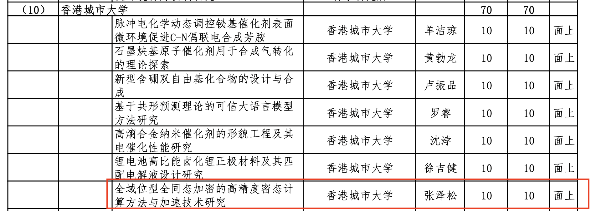

We're celebrating a significant milestone as Prof. Ray C.C. Cheung has been awarded funding from the Guangdong Basic and Applied Basic Research Fund (Guangdong Natural Science Fund) for 2026!
<!--more-->

This prestigious grant supports the research project "Research on High-Precision Ciphertext Computation Methods and Acceleration Technologies for Full-Domain Bitwise Fully Homomorphic Encryption."

This achievement represents an important expansion of CALAS's research presence on the mainland and underscores our commitment to advancing fully homomorphic encryption (FHE) technology. The successful application reflects the collaborative excellence of our research team, with special recognition going to our postdoc members, particularly Shiyu, whose major contributions were instrumental in securing this competitive funding.

This grant marks an exciting beginning for our FHE research initiatives and strengthens our capacity to tackle critical challenges in privacy-preserving computation and cryptographic acceleration. We look forward to the innovative outcomes this project will generate as we continue building an even stronger research team.

Congratulations to Prof. Ray and the entire team!

[Official Notice](https://gdstc.gd.gov.cn/zwgk_n/tzgg/content/post_4796434.html)