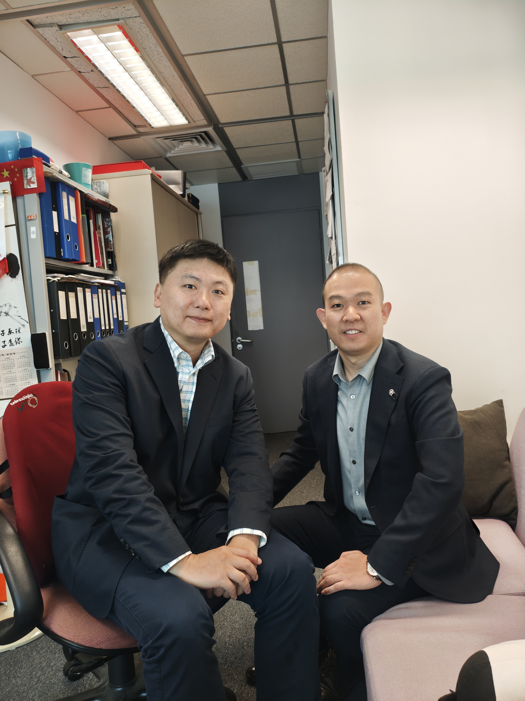
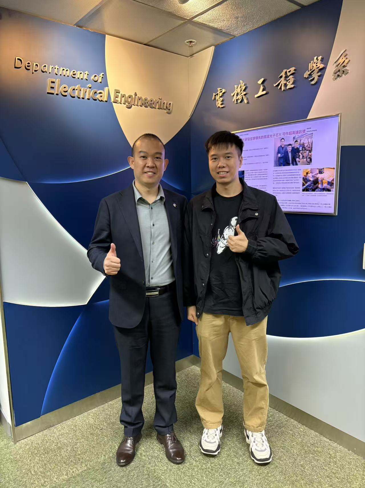
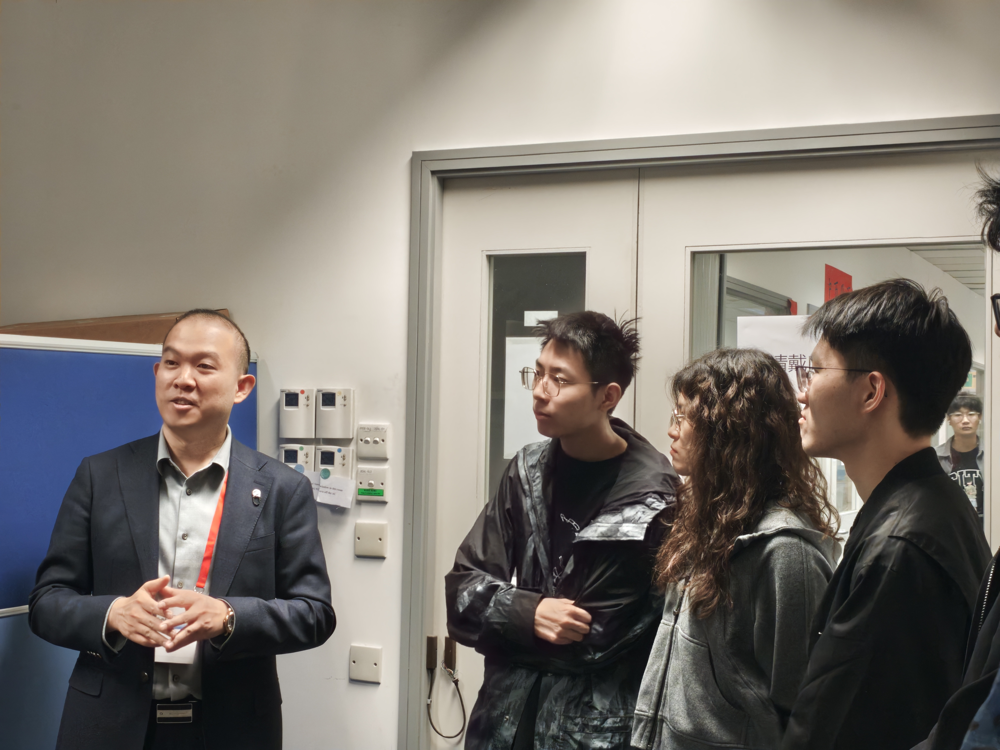
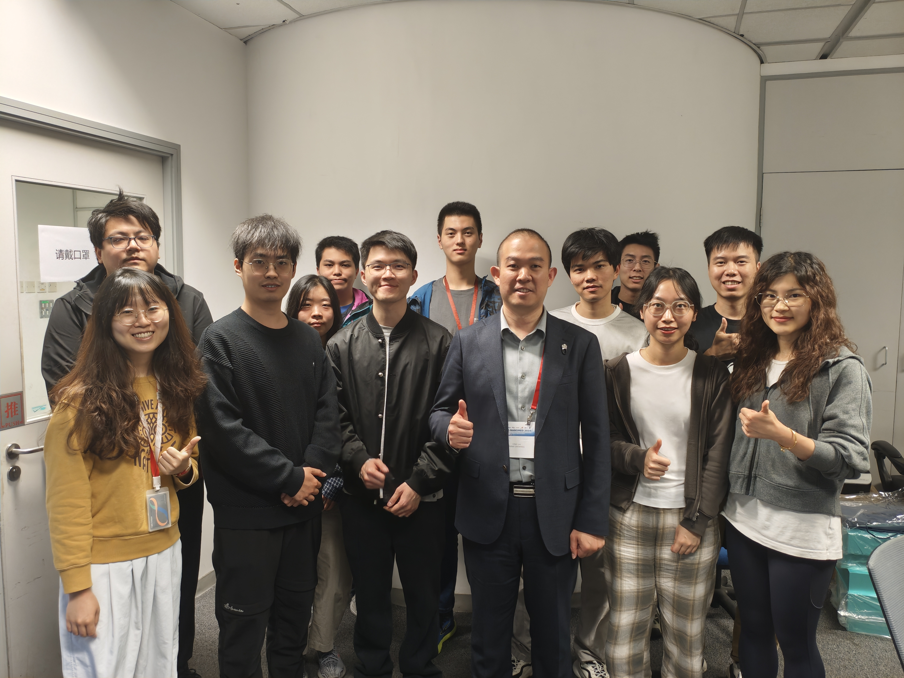

We are honored to welcome Prof. Chen Liu from Xidian University (XD) to CALAS today!
<!--more-->

|  |  |
|-----------------|-----------------|
|  |  |

Prof. Liu brings exceptional expertise in brain-machine interfaces, flexible and biodegradable electronics, and novel heterogeneous integrated devices—research areas that align beautifully with our lab's innovative pursuits.

Our sincere thanks to Postdoc Joshua for organizing this visit and introducing CALAS to Prof. Liu. His distinguished background includes collaborative research at University of Wisconsin-Madison with Prof. Zhenqiang (Jack) Ma, an esteemed Fellow of APS, IEEE, NAI, and AAAS. Prof. Liu has published over 30 papers in premier journals including Advanced Materials (5-year IF: 30.2) and serves in editorial positions for multiple international journals.

This visit strengthens the meaningful connection between CALAS and Xidian University, where our own Dr. Bill Min also completed his studies. Prof. Liu is actively engaging with our team members, sharing valuable insights and fostering collaborative opportunities that promise to advance our research frontiers.

