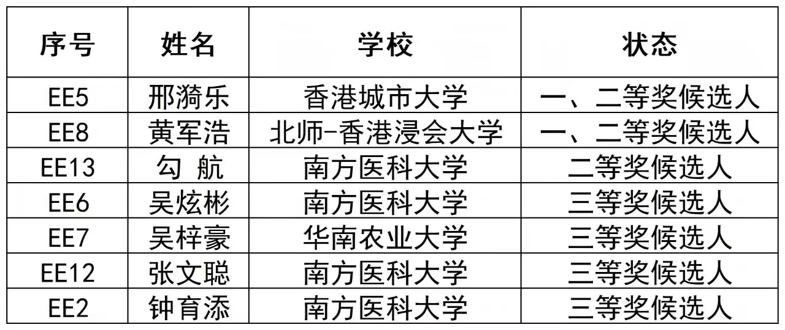

CALAS student Yile Xing has been nominated as a First/Second Prize Candidate in the 5th (2025) Guangdong-Hong Kong-Macao Greater Bay Area Outstanding Postgraduate Thesis Competition Engineering Application category.
<!--more-->

We are thrilled to congratulate Yile Xing (邢漪乐) on being nominated as a First/Second Prize Candidate (一、二等奖候选人) in the Engineering Application category of the 5th (2025) Guangdong-Hong Kong-Macao Greater Bay Area Outstanding Postgraduate Thesis Competition!

As a representative from City University of Hong Kong, Yile's outstanding work has earned this well-deserved recognition among talented students from universities across the Greater Bay Area. This nomination reflects not only Yile's dedication and technical excellence but also the high-quality training provided at CALAS.

We look forward to the final results and wish Yile the very best in the upcoming evaluation. This achievement showcases the innovative spirit and engineering capabilities that our lab strives to cultivate.

 

For more details, please visit the [official announcement](https://mp.weixin.qq.com/s/tWWH4-zwp6Mvv3dy-weorA).