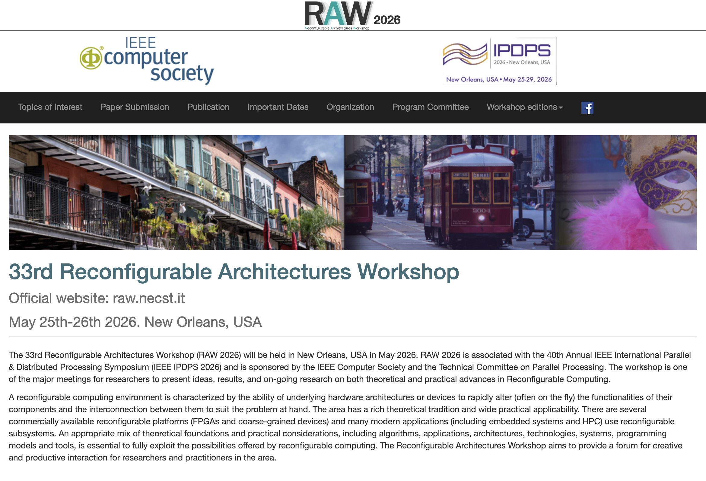

Congratulations are in order for Prof. Ray, who has been invited to join the Program Committee for the 33rd Reconfigurable Architectures Workshop (RAW 2026)!

<!--more-->

RAW is one of the longest-running and most prestigious workshops in the reconfigurable computing community, now entering its 33rd edition. The workshop will be held in New Orleans, USA, on May 25-26, 2026, in conjunction with the 40th Annual IEEE International Parallel & Distributed Processing Symposium (IEEE IPDPS 2026). Sponsored by the IEEE Computer Society and the Technical Committee on Parallel Processing, RAW provides a premier forum for researchers and practitioners to share advances in FPGA architectures, hardware acceleration, and reconfigurable systems.

This invitation recognizes Prof. Ray's expertise and ongoing contributions to the field. As a Program Committee member, he will help shape the technical program by reviewing submissions and guiding discussions on cutting-edge research. Workshop proceedings will be published in IEEE Xplore, with top papers invited to submit extended versions to a special issue of ACM Transactions on Reconfigurable Technology and Systems (TRETS).

We also encourage our CALAS team members to consider submitting papers to RAW 2026. The submission deadline is January 20, 2026. Congratulations, Prof. Ray!

 

For more details, please visit the [RAW 2026 Website](http://raw.necst.it/).