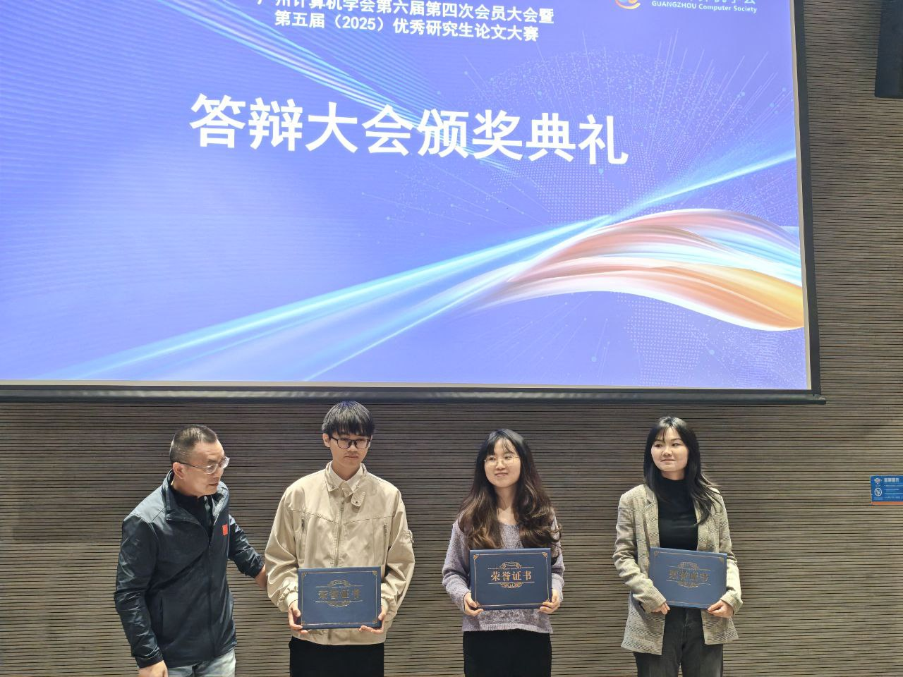

Dr. Joshua wins First Prize and Yile secures Second Prize at the 5th Guangzhou Computer Society Outstanding Graduate Paper Competition (2025). 

<!--more-->

We couldn't be prouder of Dr. Joshua and Yile for their outstanding achievements at the 5th (2025) Greater Bay Area Outstanding Graduate Paper Competition (第五届粤港澳优秀研究生论文大赛), held during the Guangzhou Computer Society 6th Council 4th General Assembly (广州计算机学会第六届第四次会员大会)!

Dr. Joshua claimed First Prize, while Yile earned a well-deserved Second Prize, demonstrating that CALAS's solid research work has been recognized by fellow scholars across the region.

This prestigious competition, organized by the Guangzhou Computer Society (GZCS), brings together outstanding graduate researchers from universities across Guangdong, Hong Kong, and Macau to showcase cutting-edge research in computer science.

These achievements highlight CALAS's continued commitment to research excellence. As Prof. Ray Cheung noted, every milestone—papers, awards, patents—builds momentum toward greater heights!

