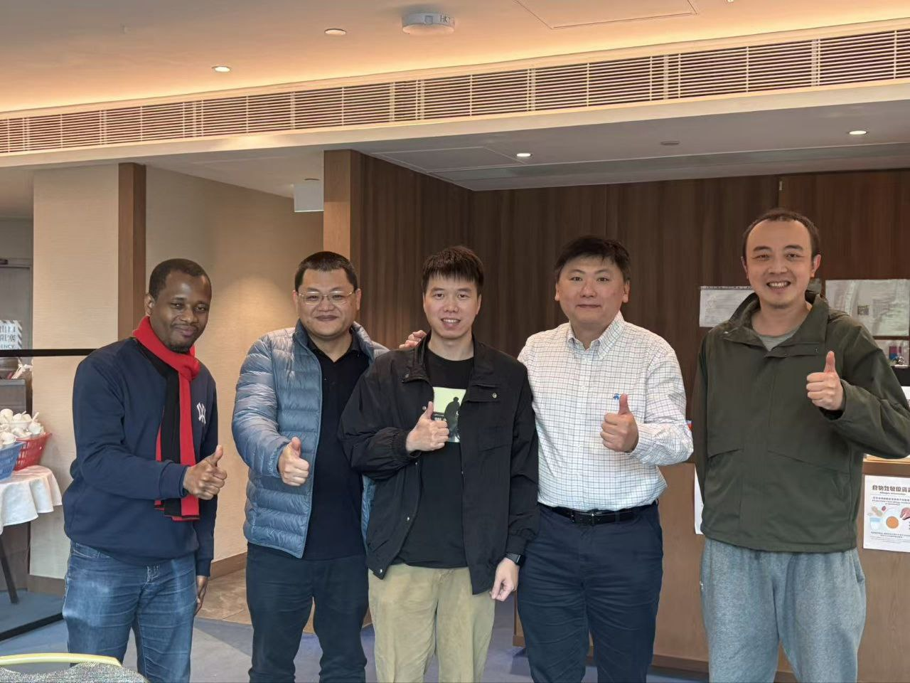

CALAS bids farewell to Dr. Joshua as he completes his 3-month postdoc training and embarks on a new journey in Singapore.

<!--more-->

A new chapter begins as we bid a fond farewell to Dr. Joshua, who has successfully completed his 3-month postdoctoral training at CALAS!

During his time with us, Dr. Joshua made valuable contributions to our research endeavors and became an integral part of our lab family. His dedication, collaborative spirit, and research excellence have left a lasting impression on our team.

As Dr. Joshua heads to Singapore to pursue the next phase of his career, we extend our heartfelt gratitude for his contributions and wish him continued success in all his future endeavors.

Special thanks to Prof. Ray Cheung, Dr. Sanka, Dr. Paul, and all CALAS team members for their mentorship and support throughout Dr. Joshua's time with us.

We look forward to future collaborations and hope our paths will cross again. Wishing you a bright and prosperous future, Dr. Joshua!

