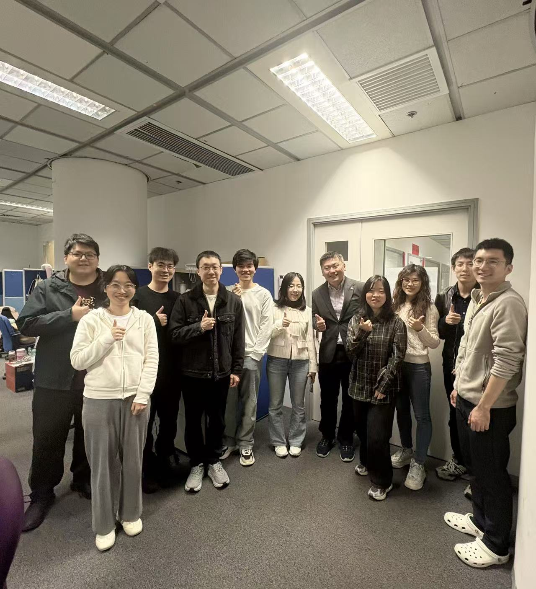

CALAS welcomes Judith as our newest PhD student this semester, continuing her research journey under the co-supervision of Prof. Ray Cheung and Ir Prof. Alan Lam, JP.

<!--more-->

We are delighted to welcome Judith to the CALAS PhD team as we kick off the new semester! Judith is no stranger to our lab—she previously completed her Master's degree at City University of Hong Kong, where she undertook her final year project with CALAS. Her familiarity with our research environment and dedication to her work made her an ideal candidate to continue her academic journey with us.

Judith will be pursuing her PhD under the co-supervision of Prof. Ray Cheung and Ir Prof. Alan Lam, JP, Adjunct Professor at the Hong Kong Polytechnic University. She will be taking up the seat from Dr. Joshua, continuing the strong tradition of excellence in our research team.

In Judith's own words: "It is truly an honor to continue working under Prof. Ray's supervision, and I am eager to learn and grow further alongside all of you."

Welcome aboard, Judith!

