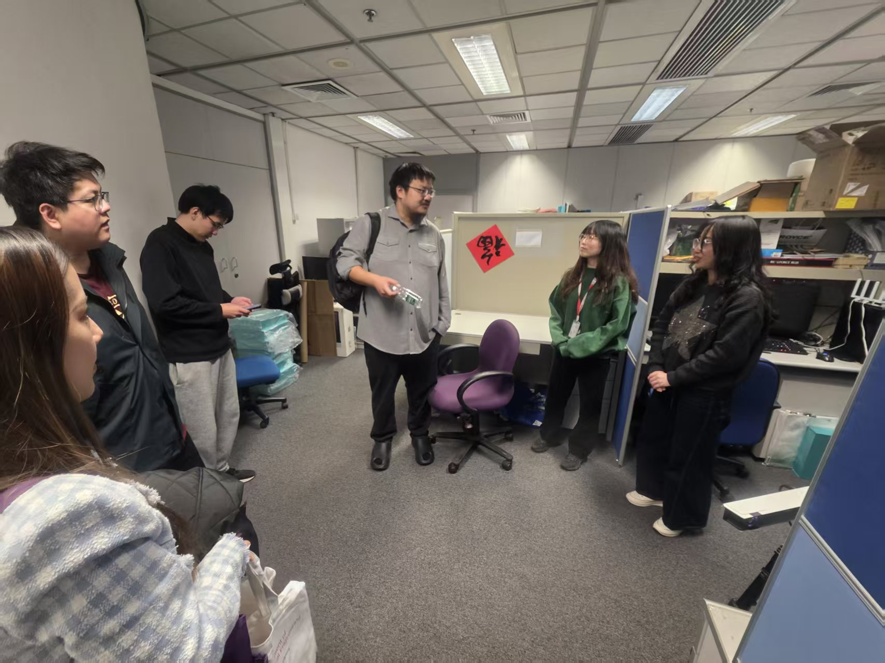

We are delighted to welcome Ren Qingyuan (任清源) to the CALAS research family as he begins his PhD journey at City University of Hong Kong.

<!--more-->

Our team grows stronger with the addition of Ren Qingyuan (任清源), who officially joined CALAS on January 8th as a PhD student at City University of Hong Kong. We're excited to have him on board!

Qingyuan brings a unique combination of academic excellence and industry expertise to our team. He earned his Master's degree in Engineering Management from Duke University in 2020 and his Bachelor of Science degree in Physics (Comprehensive Physics) from The University of Washington in 2018. Following graduation, he gained valuable professional experience at Lenovo before moving to RiVAI Technologies, where he currently leads the productization of high-performance RISC-V CPU chips, driving the full development cycle from system design to commercial deployment in cutting-edge computing applications.

His extensive background in RISC-V architecture and hardware design aligns perfectly with CALAS's research focus, and we look forward to the innovative contributions he will bring to our lab!

