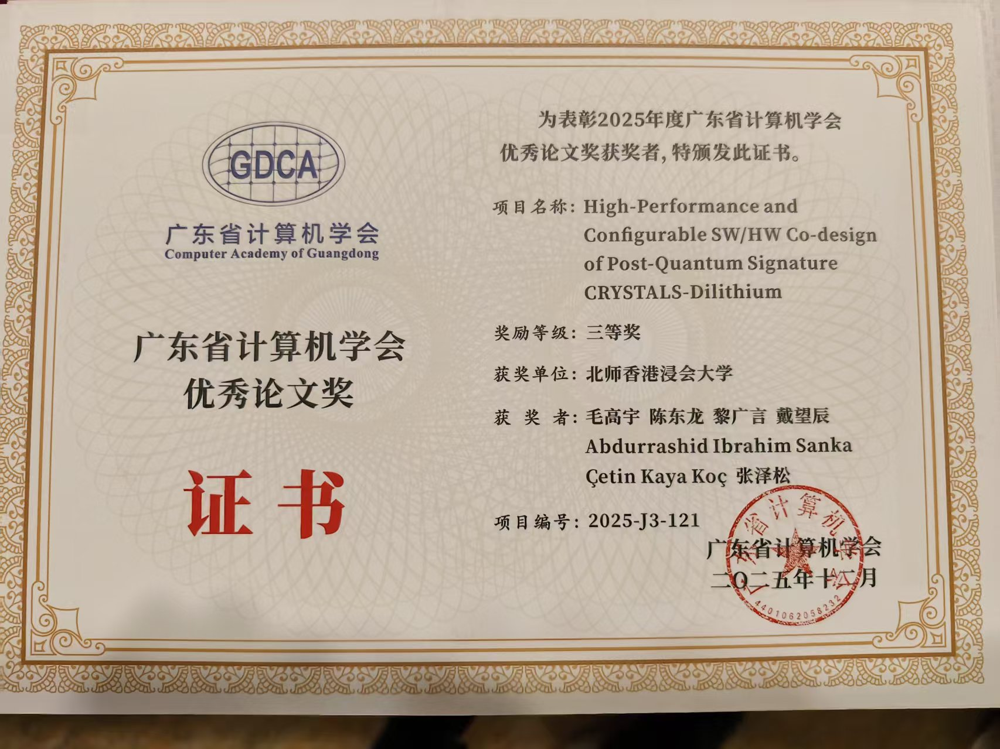

Excellence has been recognized as our CALAS team, led by Dr. Gary, secures third prize at the prestigious Guangdong Computer Academy's 2025 Outstanding Paper Competition for their groundbreaking work on post-quantum cryptography.

<!--more-->

We're celebrating outstanding achievement as Dr. Gary, alongside CALAS team members Dr. Donald, Dr. Gavin, Dr. Winston, and Dr. Abdurrashid Ibrahim Sanka, has been awarded third prize by the Guangdong Computer Academy (广东省计算机学会) for their exceptional research paper titled "High-Performance and Configurable SW/HW Co-design of Post-Quantum Signature CRYSTALS-Dilithium."

This recognition from the Guangdong Computer Academy—a leading provincial organization advancing computer science research and innovation—underscores the high caliber of CALAS's work in post-quantum cryptography. The team's research on CRYSTALS-Dilithium, one of the NIST-selected post-quantum signature schemes, demonstrates innovative hardware-software co-design approaches that achieve both high performance and configurability—critical requirements for practical deployment of quantum-resistant cryptographic systems.

This achievement reflects CALAS's continued leadership in cryptographic hardware acceleration and post-quantum security. As Prof. Ray emphasized, every recognition from fellow scholars across the Greater Bay Area validates our commitment to research excellence. Congratulations to the entire team!

