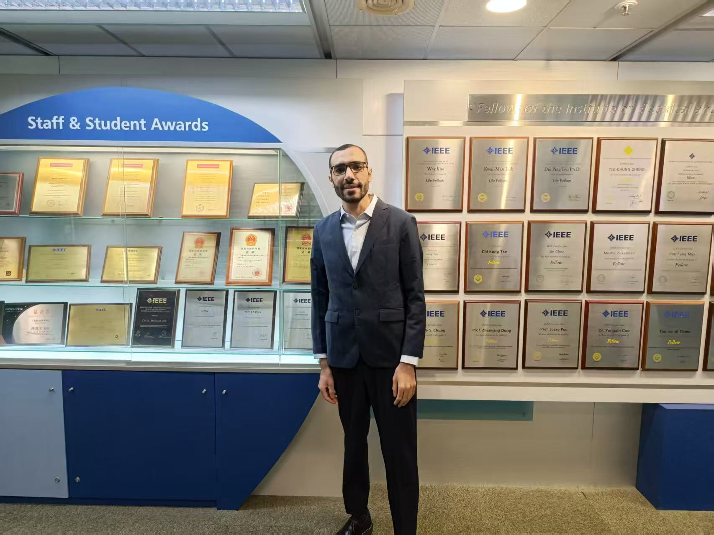

We are thrilled to congratulate Dr. Ashraf on passing his PhD defense examination! 

<!--more-->

His doctoral research under the supervision of Prof. Ray Cheung and Prof. Hong Yan has focused on advancing hardware acceleration techniques for machine learning and signal processing applications. Dr. Ashraf's innovative work spans efficient tensor decomposition algorithms, FPGA-based reconfigurable systems, and hardware copyright protection frameworks for AI-generated content applications.

Throughout his doctoral journey, Dr. Ashraf has made significant contributions to the field through publications in prestigious venues including IEEE Transactions on Neural Networks and Learning Systems, Neurocomputing, Remote Sensing, and the IEEE ASAP conference. His research on randomized tensor decomposition using parallel reconfigurable systems and efficient blind hyperspectral unmixing frameworks demonstrates the practical impact of algorithm-hardware co-design in advancing computational efficiency for modern AI applications.

We wish Dr. Ashraf continued success and prosperity in his future career endeavors!

