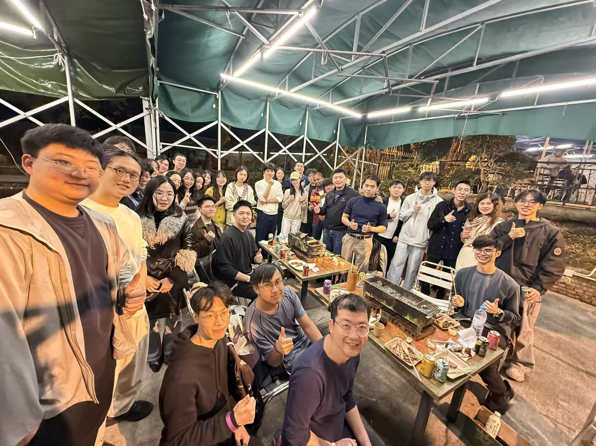
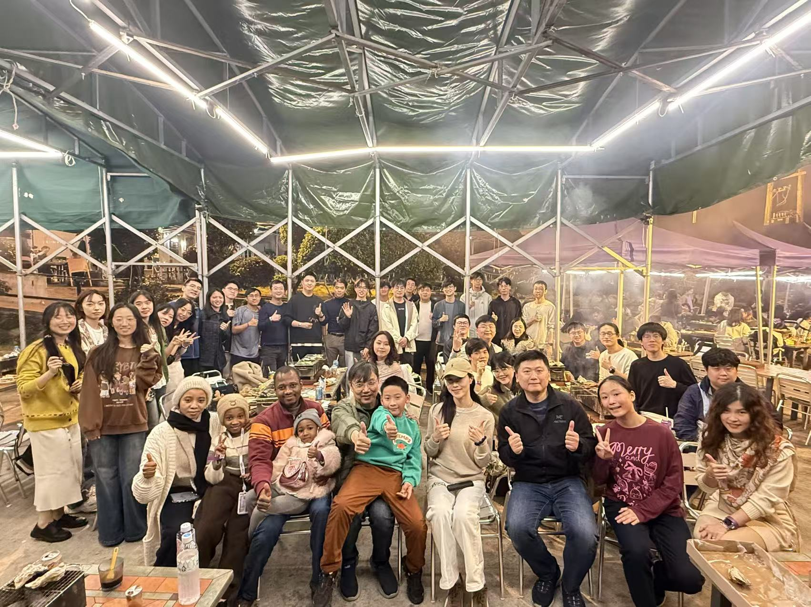
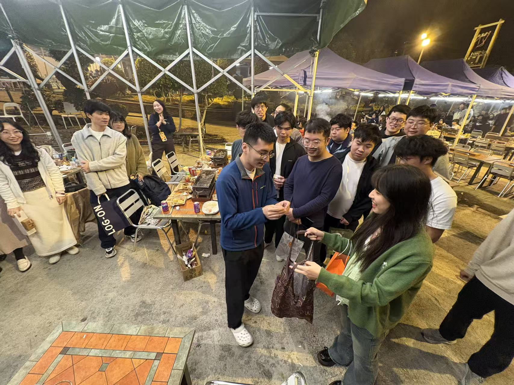
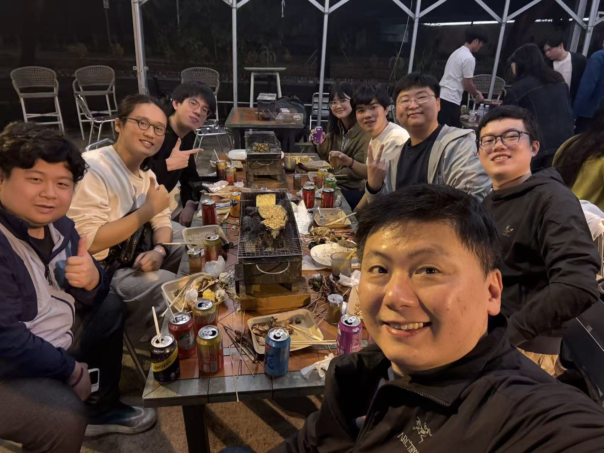
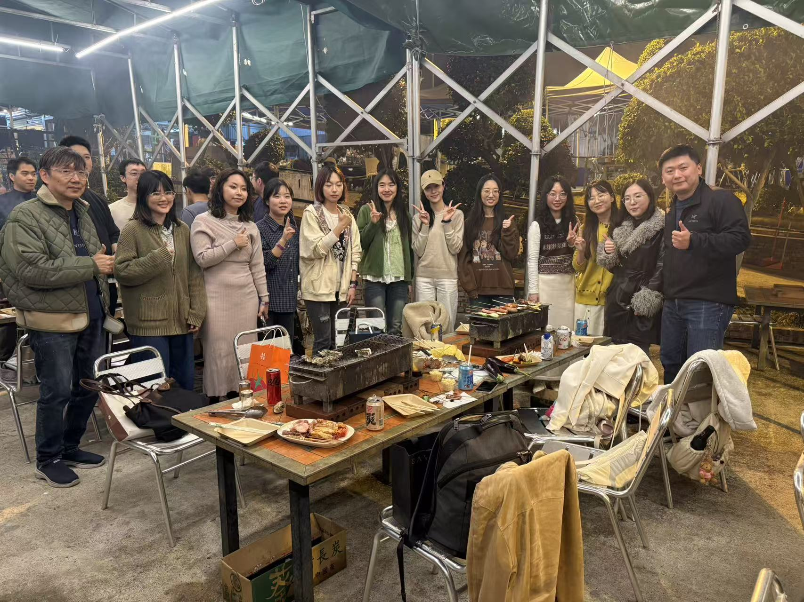

What an exhilarating evening at our flagship annual CALAS BBQ gathering!

<!--more-->

On January 31st, the CALAS family gathered at the beautiful seaside venue of Bahia Restaurant Chung King BBQ (巴希雅海灣燒烤) at 101 Ting Kok Rd, Ting Kok, Hong Kong for our flagship annual BBQ gathering. It was truly a memorable night filled with great food, wonderful conversations, and quality time together.

We were delighted to welcome our special alumni, including Ellyn from CityUHK, who speaks highly of our team members. It's always heartwarming to see the friendship, brotherhood, and trust that we have built over the years continue to grow stronger. The gift exchange session after the BBQ was especially memorable, bringing joy and laughter to everyone!

Many thanks to Prof. Ray and his family, Prof. Patrick, and every CALAS member for making this amazing night possible. Big thanks also to Patrick for the great support, and to Jerry and Jimmy for the excellent coordination. It was fantastic meeting so many new friends and reconnecting with familiar faces.

We truly cherish these moments of bonding between all members. Here's to more wonderful gatherings in the future!

| | |
|:---:|:---:|
|  |  |
|  |  |
|  |  |
