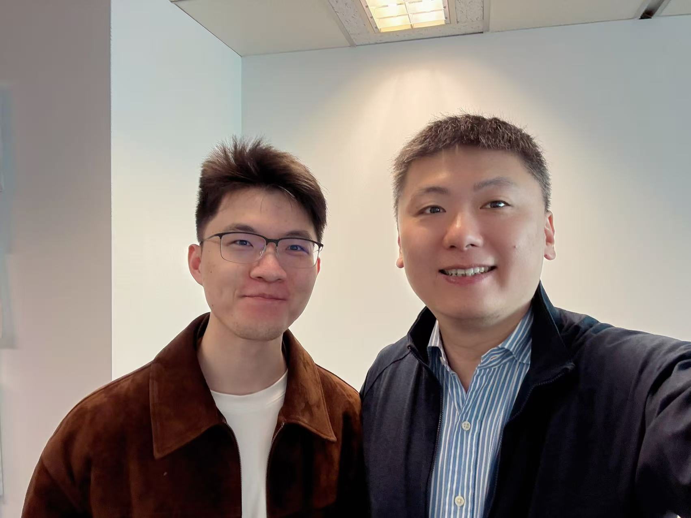
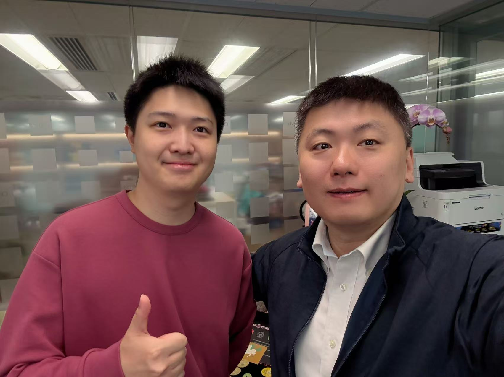

Congrats to Jerry ZHANG for getting a minor revision for IoT Journal!
<!--more-->

  
  

Congrats to Jerry ZHANG for getting a minor revision for his paper: **"Less is More: Latent Diffusion for Efficient IoT Side-Channel Analysis"** submitted to IEEE Internet of Things Journal!

This work explores the innovative application of latent diffusion models to IoT side-channel analysis, demonstrating that efficient and lightweight approaches can achieve superior performance in security-critical applications. The research has significant implications for enhancing the security of IoT devices while maintaining computational efficiency.

Nice teamwork with Donald, Winston, Jeffrey, and Mark. Keep up the good work, and be proactive to seek advice from Prof. Ray, Patrick, and our advisors!

