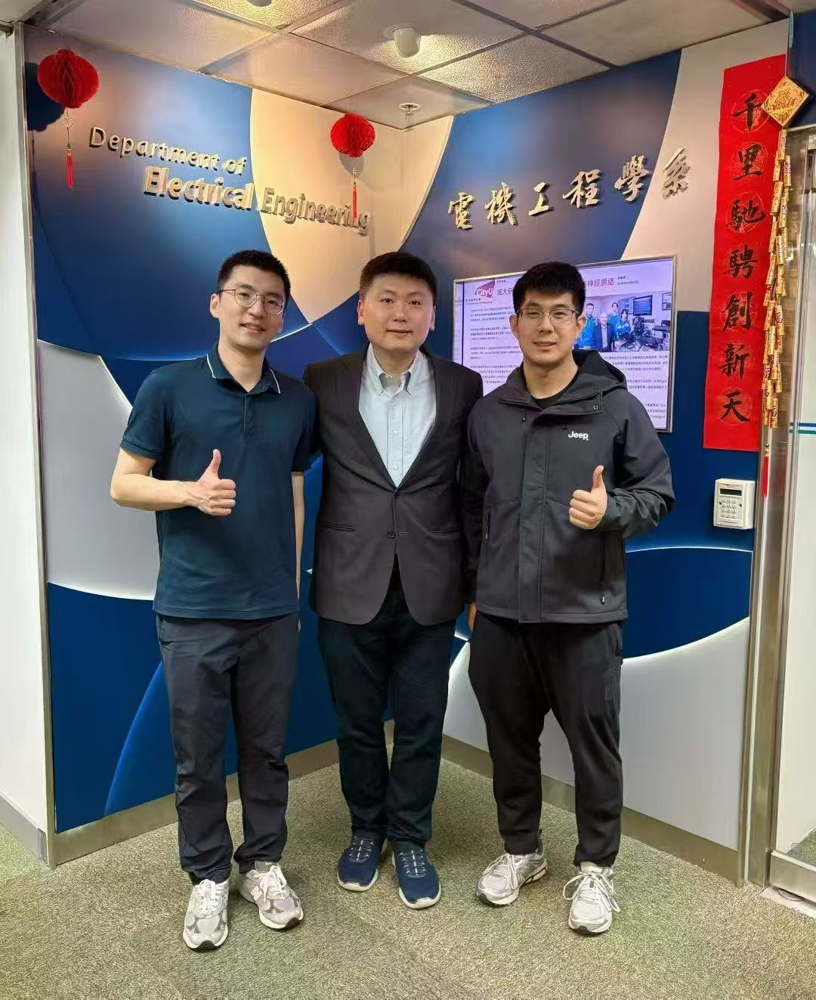

Happy Lantern Festival to everyone!
<!--more-->

  

We are delighted to celebrate this festive occasion by sharing exciting news about two outstanding PhD students from City University of Hong Kong who have embarked on remarkable international research exchange journeys.

Simon has recently completed a six-month research exchange at Tsinghua University in Beijing, China, working with Professor Wang's research group in the Department of Electronic Engineering. During his time there, Simon gained invaluable research experience and established meaningful academic connections. He has just returned to Hong Kong, bringing back fresh perspectives and collaborative opportunities for our lab.

Meanwhile, Leo is preparing for an exciting new chapter as he will depart this summer for a six-month research exchange at Cornell University in the United States. He will join Professor Zhang's research group, where he will contribute to cutting-edge projects and broaden his research horizons.

These international exchange opportunities exemplify CALAS's commitment to fostering global academic collaborations and providing our students with world-class research experiences. We are incredibly proud of both Simon and Leo for seizing these prestigious opportunities to advance their academic careers.

Best wishes to all as we kick off the new year with exciting projects ahead!

