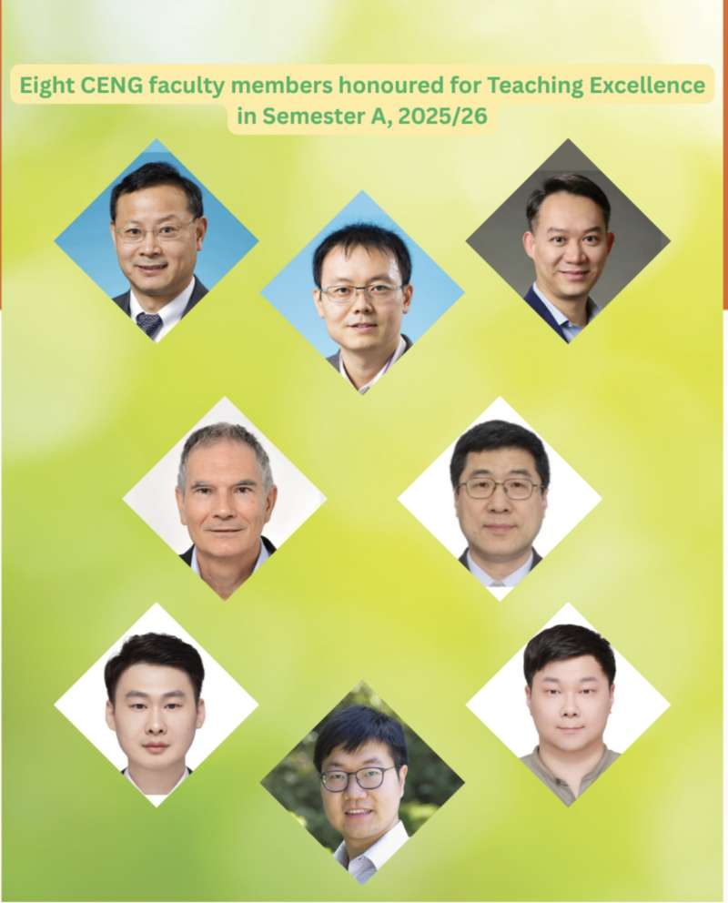
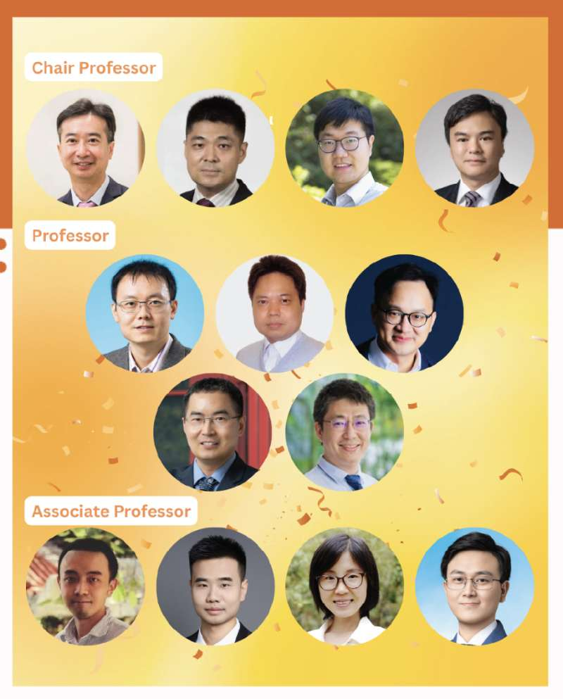
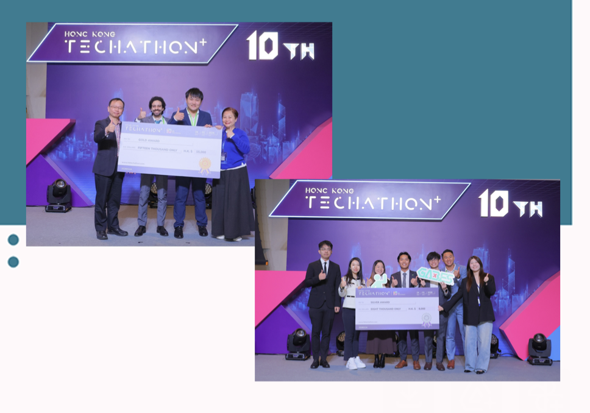

Congrats Alan for winning TEA award, Liang for promoting to Associate Professor, and Wilson and Gabes team for winning Techathon award!
<!--more-->

  
  

Congrats Alan for winning the **Teaching Excellence Award (TEA)**! This prestigious recognition reflects Alan's outstanding dedication to teaching and inspiring students. Well deserved!

Congrats Liang for his major promotion to **Associate Professor** again! A remarkable milestone — we are all proud of this achievement!

  

Congrats **Wilson and the Gabes team** for winning the **Techathon award**! Another fantastic achievement that showcases the team's innovation and hard work. Keep it up!

