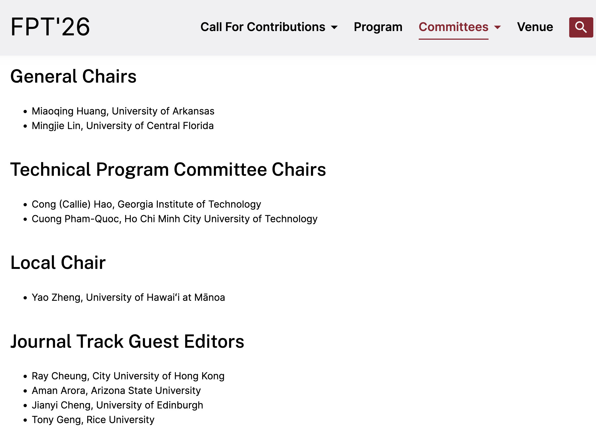

We are pleased to announce that Prof. Ray has been appointed as the ACM TRETS Journal Track Guest Editor for the International Conference on Field-Programmable Technology (FPT'26).

<!--more-->

FPT is one of the premier international conferences dedicated to field-programmable technology, encompassing reconfigurable computing devices, systems, and applications. The 2026 edition will be hosted by the University of Arkansas and brings together leading researchers and practitioners from around the world. As the ACM Transactions on Reconfigurable Technology and Systems (TRETS) Journal Track Guest Editor, Prof. Ray will oversee the review and selection of outstanding conference submissions for extended publication in ACM TRETS.

This appointment reflects Prof. Ray's sustained contributions and recognized expertise in the FPGA and reconfigurable computing community. We encourage all CALAS members and collaborators to prepare high-quality submissions to FPT'26 and other major FPGA conferences. For further details on the organizing committee, please visit the [official FPT'26 website](https://fpt2026.uark.edu/organizing-committee/).

