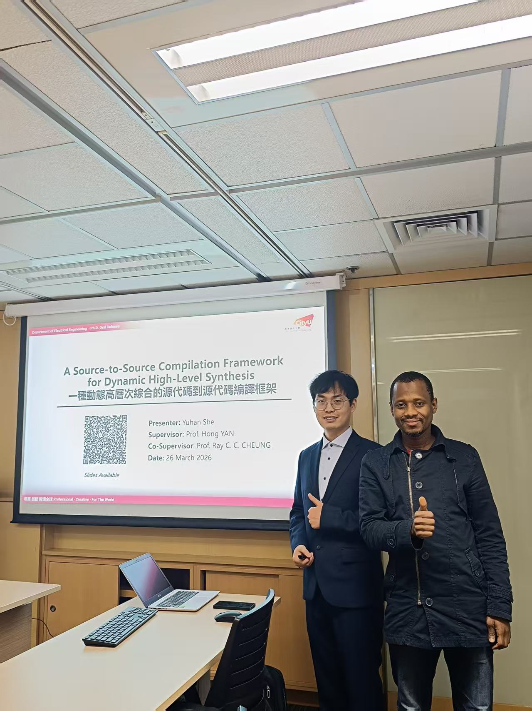

We are delighted to congratulate Dr. Henry SHE on successfully completing his PhD oral presentation!

<!--more-->

On March 26, 2026, Henry completed a rigorous 90-minute oral examination and delivered an excellent presentation. The examiners highly recognized his performance and commended him for a great job throughout the defense.

This achievement marks an important milestone for Henry and a proud moment for the entire CALAS team. We are pleased to celebrate his success and extend our sincere congratulations on becoming another PhD graduate of CALAS.

We wish Dr. Henry every success in his future research and career endeavors. Congratulations once again on this outstanding accomplishment!

