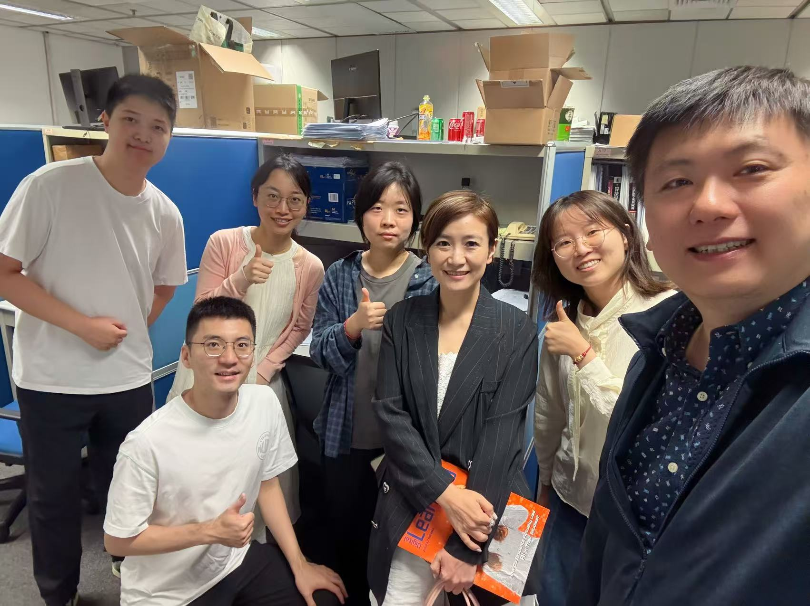
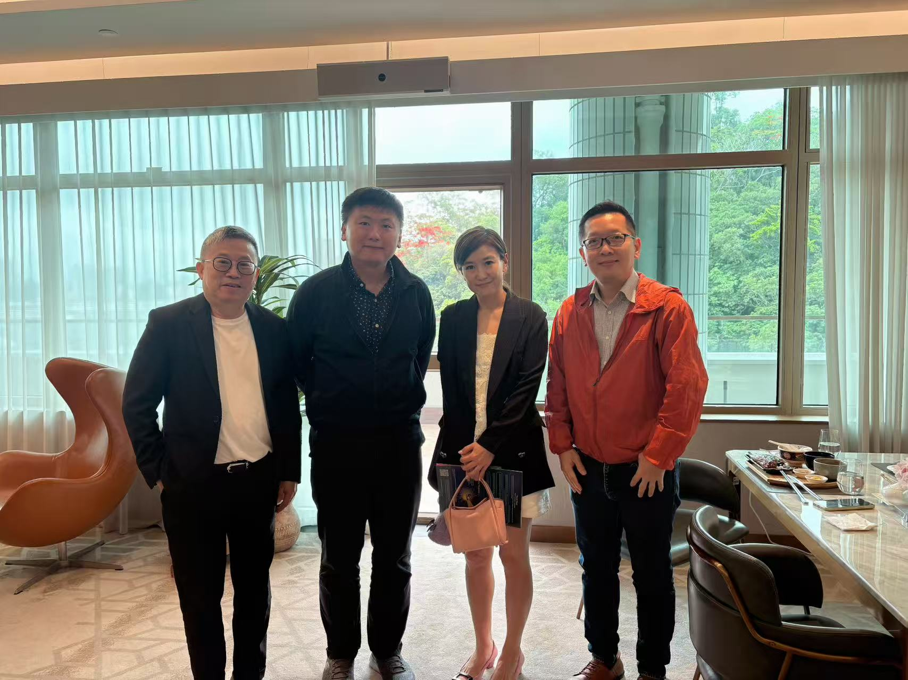
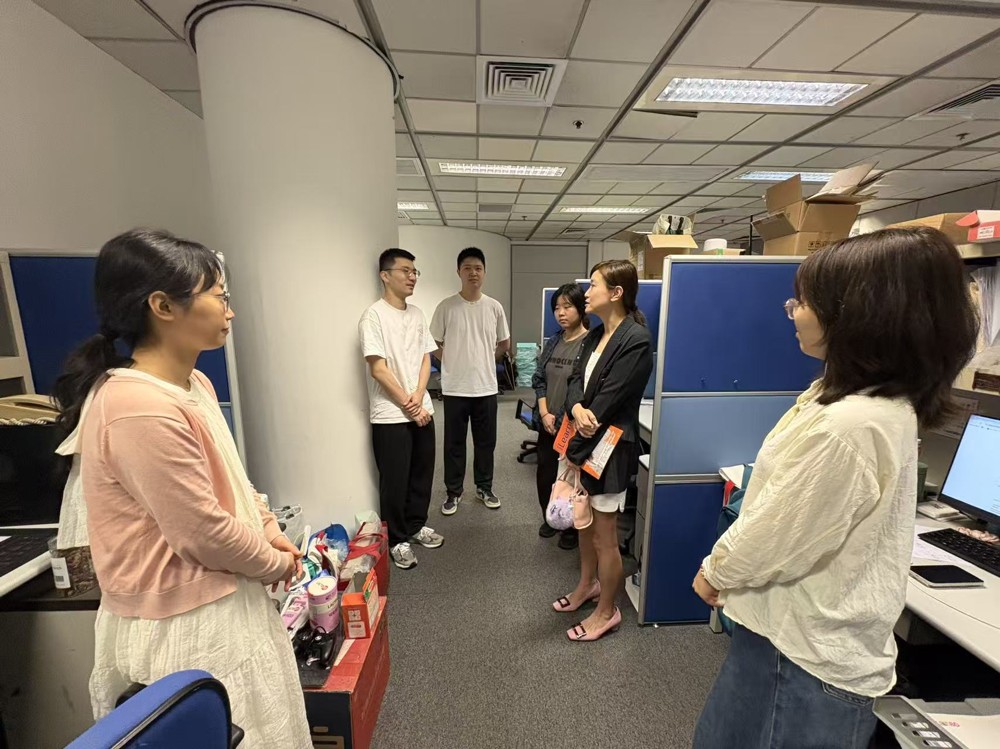
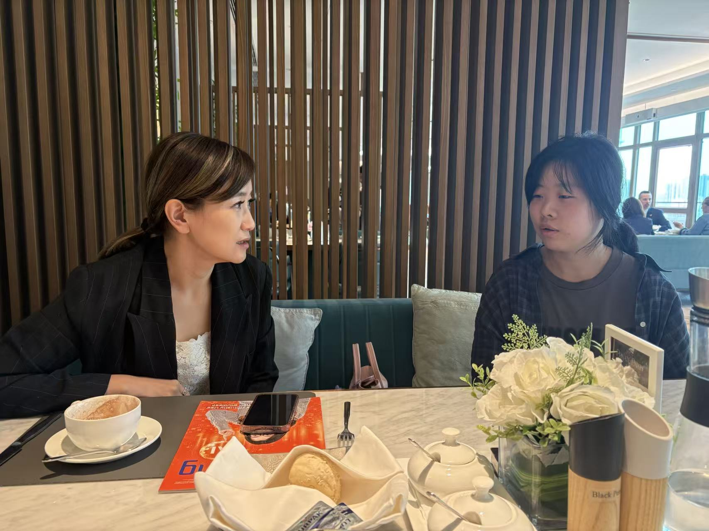

We are pleased to share a meaningful learning opportunity for our team through the Hong Kong United Youth Association and the 33rd \"Politics and Public Administration\" course jointly organized with City University of Hong Kong.

<!--more-->

|  |  |
|-----------------|-----------------|
|  |  |

We are pleased to share a meaningful learning opportunity connected with the Hong Kong United Youth Association (HKUYA) and the 33rd \"Politics and Public Administration\" course jointly organized with City University of Hong Kong.

This initiative brings together academic insight, public affairs, and youth development, creating a valuable platform for students and young members to broaden their understanding of leadership, governance, and public administration. It is encouraging to see educational institutions and youth organizations work together to cultivate future leaders through structured dialogue, practical exposure, and exchange.

We are also glad to introduce Elsa to Zoe and our team. As the Chief Secretary of HKUYA, Elsa plays an important role in supporting the association's work in youth development, policy engagement, training, and community building.

Prof. Ray's message to the team captures the spirit of this occasion well: academic research is only one part of life, and it is important to enrich ourselves through learning opportunities in multiple dimensions. Experiences like this help broaden horizons and strengthen the sense of social responsibility among young scholars.

Related links:

- [CityUHK and HKUYA launch the 33rd \"Politics and Public Administration\" course](https://www.cityu.edu.hk/zh-hk/media/news/2026/04/30/cityuhk-and-hkuya-launch-the-33rd-politics-and-public-administration-course)
- [About the Hong Kong United Youth Association](https://www.hkuya.org.hk/about_us/)

