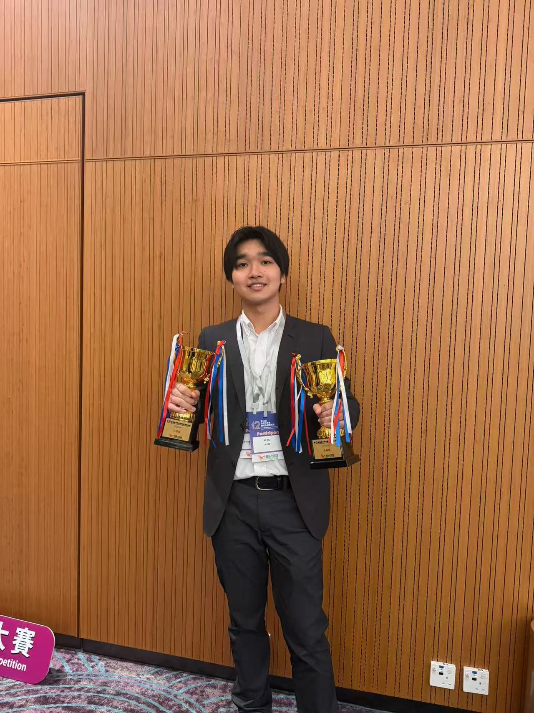
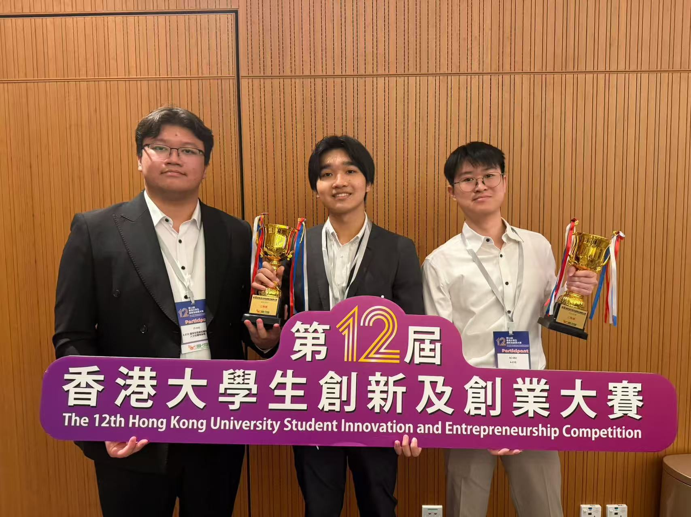

We are delighted to share that Ken Mochizuki's project, A-EYE (運用空間感知輔助視障人士的購物系統), has received Third Prize at the 12th Hong Kong University Student Innovation and Entrepreneurship Competition.

<!--more-->

We warmly congratulate Ken Mochizuki on this excellent achievement at one of Hong Kong's major university innovation and entrepreneurship competitions. His project, A-EYE, applies spatial perception to support visually impaired users in shopping scenarios, and the Third Prize recognition highlights both its social value and its practical innovation potential.

This accomplishment reflects Ken's strong entrepreneurial spirit and his willingness to translate ideas into practical and human-centered innovation. It is also an encouraging example of how early-stage students can begin building a distinctive learning profile through commitment, preparation, and sustained effort.

As Prof. Ray noted, achievements such as this remind us of the importance of planning ahead and enriching our learning journey step by step. Every meaningful effort contributes to long-term growth, and Ken's success with A-EYE offers a timely example of that spirit in action.

We extend our sincere congratulations to Ken on this well-deserved recognition and look forward to seeing the continued development of A-EYE and his future contributions to innovation and entrepreneurship.

Source: [Official organizer award-list page](https://www.hkchallengeplus.com/prize-list-and-review/%e7%ac%ac12%e5%b1%86%e9%a6%99%e6%b8%af%e5%a4%a7%e5%ad%b8%e7%94%9f%e5%89%b5%e6%96%b0%e5%8f%8a%e5%89%b5%e6%a5%ad%e5%a4%a7%e8%b3%bd-%e5%be%97%e7%8d%8e%e5%90%8d%e5%96%ae2026/) and [official PDF award list](https://www.hkchallengeplus.com/wp-content/uploads/2026/05/%E7%AC%AC12%E5%B1%86%E9%A6%99%E6%B8%AF%E5%A4%A7%E5%AD%B8%E7%94%9F%E5%89%B5%E6%96%B0%E5%8F%8A%E5%89%B5%E6%A5%AD%E5%A4%A7%E8%B3%BD-%E5%BE%97%E7%8D%8E%E5%90%8D%E5%96%AE2026.pdf).

