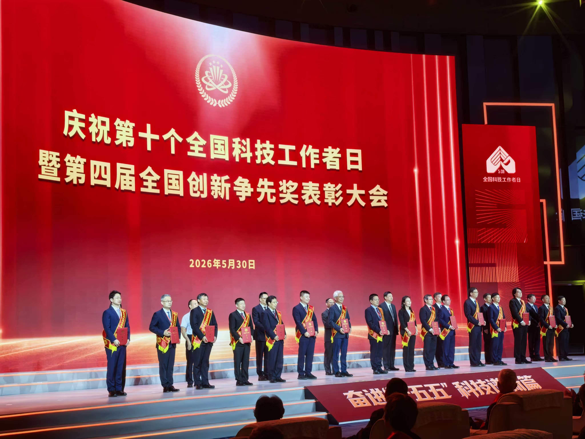
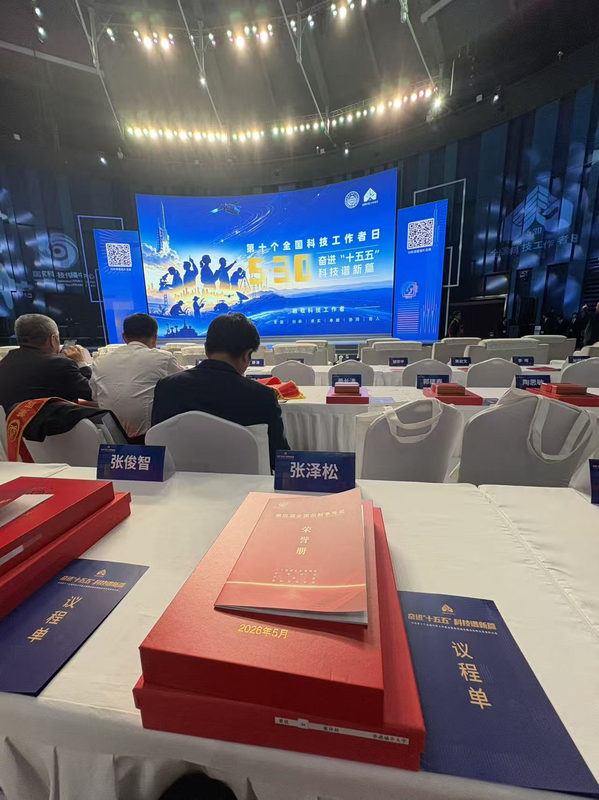
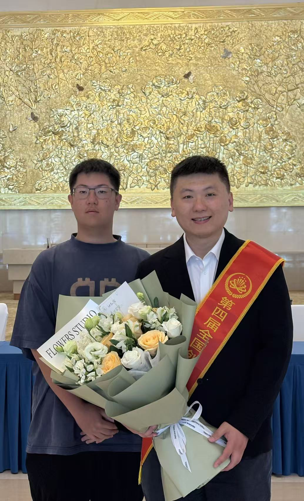

We are delighted to share that Prof. Ray C. C. Cheung has been recognized in the Fourth National Award for Excellence in Innovation (第四届全国创新争先奖), as announced by the China Association for Science and Technology on 30 May 2026.

<!--more-->

This national distinction is widely regarded as one of China's highest honors for scientific and technological talent. In the official award list, Prof. Ray is identified by his Chinese name, Zhang Zesong (张泽松), with City University of Hong Kong listed as his affiliation, and is recognized in the award certificate category.

This recognition reflects Prof. Ray's sustained contributions to reconfigurable computing, applied cryptography, trustworthy hardware systems, and interdisciplinary innovation. It also acknowledges his long-standing commitment to research excellence, talent development, and international academic collaboration through CALAS and the Department of Electrical Engineering at City University of Hong Kong.

On this special occasion, we extend our warmest congratulations to Prof. Ray on receiving this distinguished national recognition. His leadership, academic vision, and dedication to impactful research continue to inspire our students, collaborators, and the wider research community.

  
  

This achievement is a meaningful affirmation of Prof. Ray's dedication to frontier research and to fostering an environment in which young researchers are encouraged to pursue ambitious ideas with rigor, creativity, and a strong sense of purpose. We are proud to celebrate this milestone and look forward to the continued impact of his work in the years ahead.

Source: [China Association for Science and Technology announcement](https://mp.weixin.qq.com/s/rUVwaGucGsXlyI7asNgfmQ).

