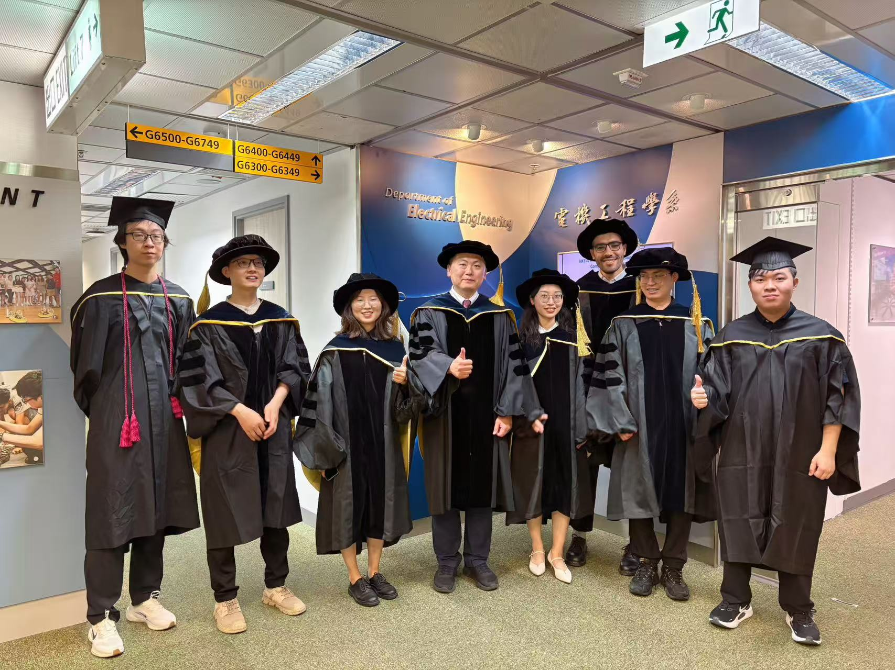
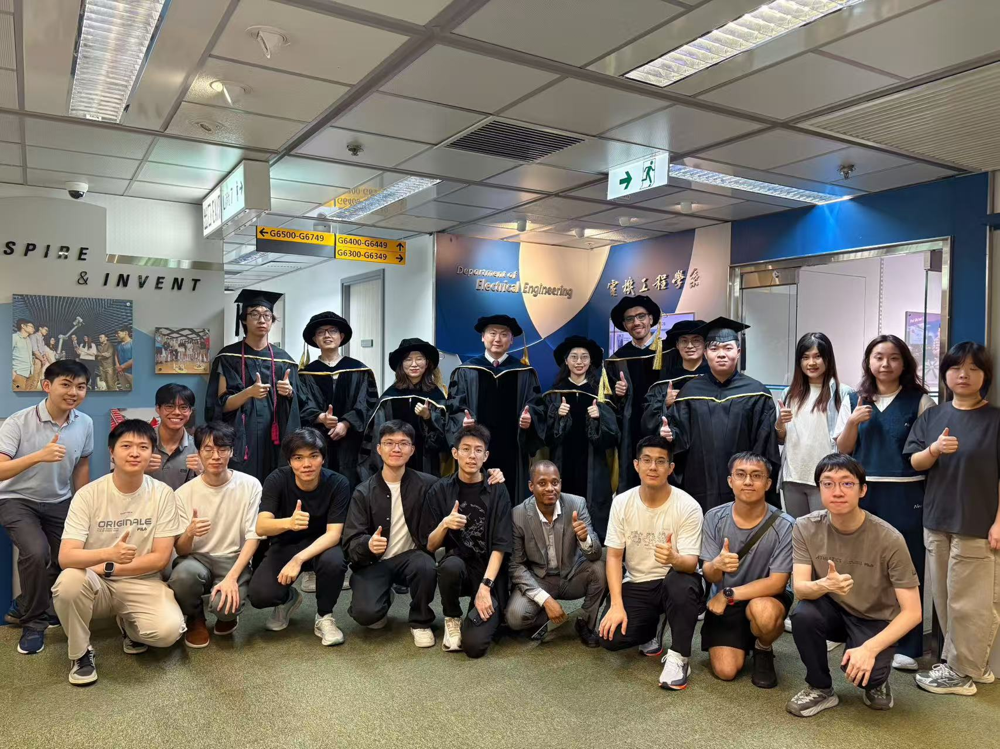

On 2026 June 15, we were delighted to celebrate an important graduation milestone for several CALAS members.

<!--more-->

|  |  |
|-----------------|-----------------|

Warm congratulations to our PhD graduates Candice ZHANG (ZHANG Zhewen), Yile XING, Henry SHE, Abdelgawad Muhammad Ashraf Abdelhamid, and Junyi Zhang on this meaningful achievement.

We also extend our sincere congratulations to William HUANG, who completed his Final Year Project, and Aobo GUO on their undergraduate graduation. Their persistence, growth, and hard work reflect the spirit of CALAS and the strong support of our research community.

Graduation is both the completion of one journey and the beginning of a new chapter. We are proud of what each of them has achieved and look forward to seeing their continued success in research, industry, and future study.

Congratulations again to all our June 15 graduates, and best wishes for the journey ahead.

