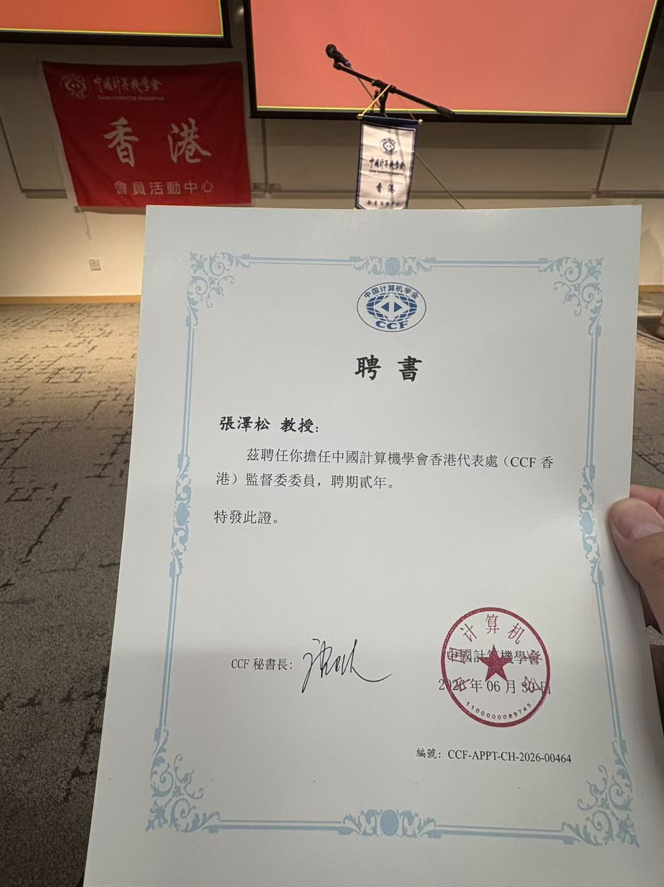

Prof. Ray C. C. Cheung has been invited to chair a Hong Kong committee of the China Computer Federation.

<!--more-->

CALAS congratulates **Prof. Ray C. C. Cheung** on being invited to serve as chair for a Hong Kong committee of the **China Computer Federation (CCF)**.

This appointment reflects Prof. Ray's sustained contributions to computing research, professional service, and academic community building in Hong Kong and beyond. CCF is a major professional organization in Mainland China, and its continued development in Hong Kong creates valuable opportunities for academic exchange, professional engagement, and collaboration across the computing community.

Prof. Ray attended the CCF Hong Kong ceremony at The Hong Kong University of Science and Technology, where the appointment was formally recognized. CALAS members are encouraged to follow and take part in CCF-related activities as the organization continues to grow in Hong Kong.

Congratulations to Prof. Ray on this meaningful professional appointment.

 

