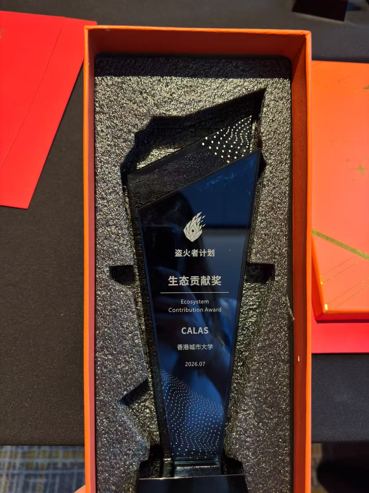

Congratulations to **Dr. Shiyu Shen** and **Dr. Hao Yang** for bringing the new **FHE Ecosystem Prize** to CALAS!

<!--more-->

This recognition celebrates the team's contribution to the open-source fully homomorphic encryption (FHE) ecosystem through the CipherFlow platform.

We extend our sincere thanks to **Prof. Ray**, **Dr. Fan**, and the **OSR/CipherFlow team** for their strong support and collaboration in building this open-source FHE platform and organizing the competition.

The team looks forward to contributing further to the project and connecting with more FHE researchers and developers.

Congratulations again to Dr. Shen and Dr. Yang on this excellent achievement!
 
