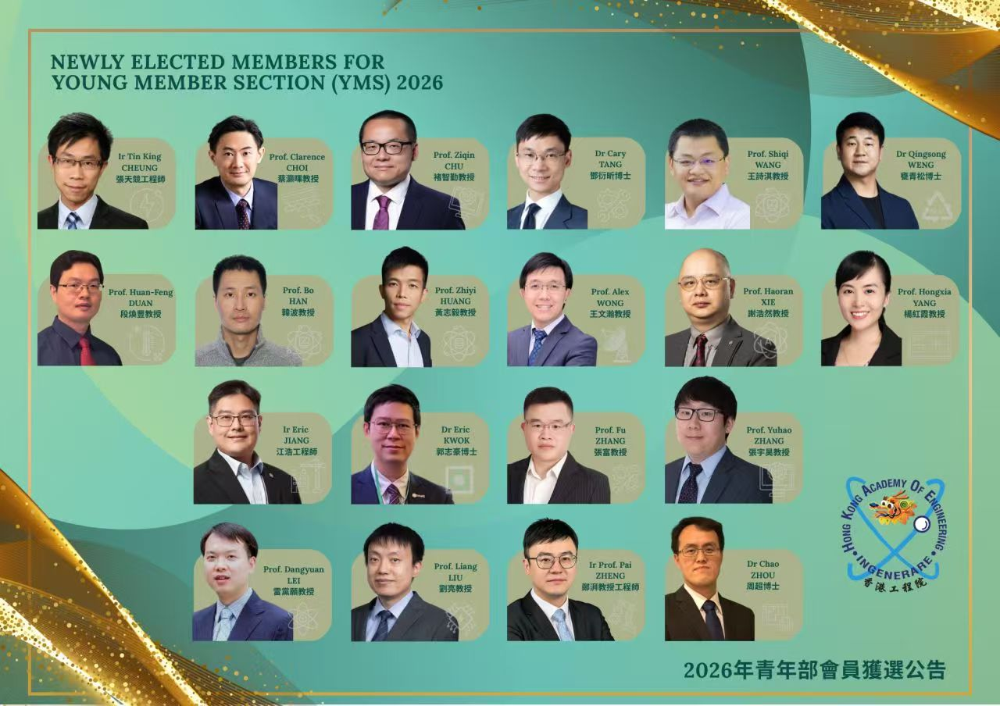

We are pleased to congratulate Prof. Shiqi Wang, Associate Head of the Department of Computer Science at City University of Hong Kong and a CALAS faculty member, on his election as a 2026 member of the Hong Kong Academy of Engineering (HKAE) Young Member Section.
<!--more-->

Prof. Wang was recognized for his work on efficient, intelligent, and sustainable data representation. His research contributes to the development of data-centric and AI-enabled technologies that are both high performing and environmentally responsible.

We also extend our sincere congratulations to Prof. Huanfeng Duan of the Department of Civil and Environmental Engineering at The Hong Kong Polytechnic University, who was elected alongside Prof. Wang. Prof. Duan was recognized for applying engineering science to enhance the resilience of urban water infrastructure.

This achievement reflects the significant contributions of emerging engineering leaders in Hong Kong. CALAS congratulates Prof. Wang and Prof. Duan on this well-deserved recognition and wishes them continued success in advancing impactful research and innovation.
